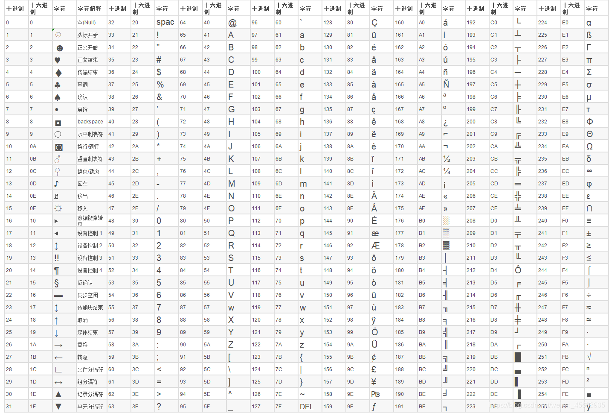
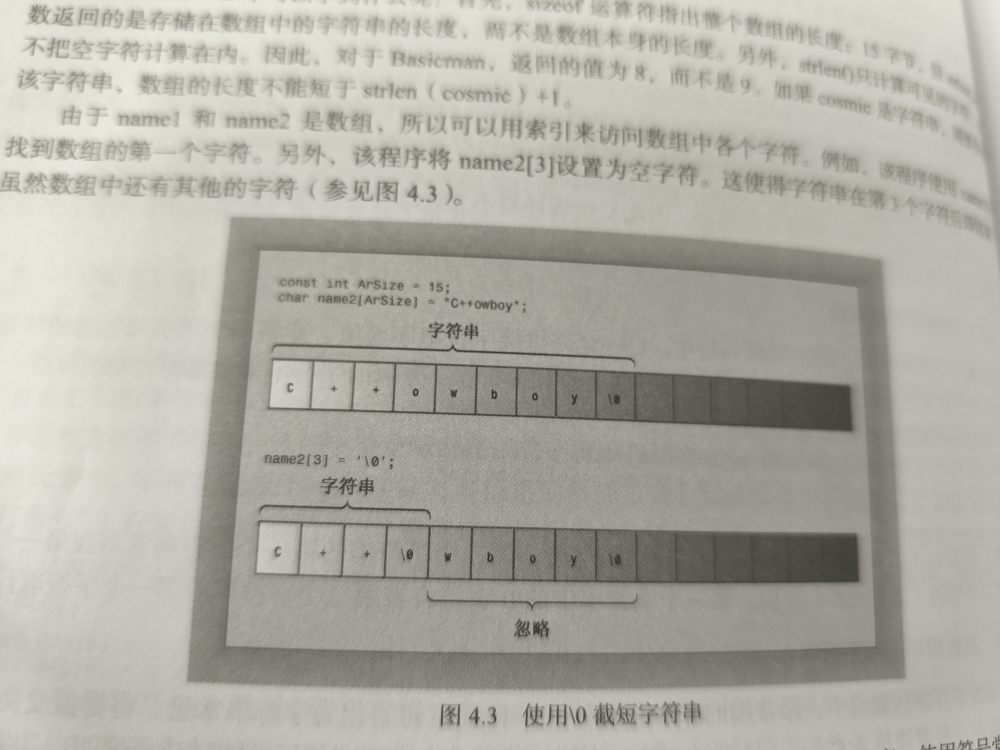
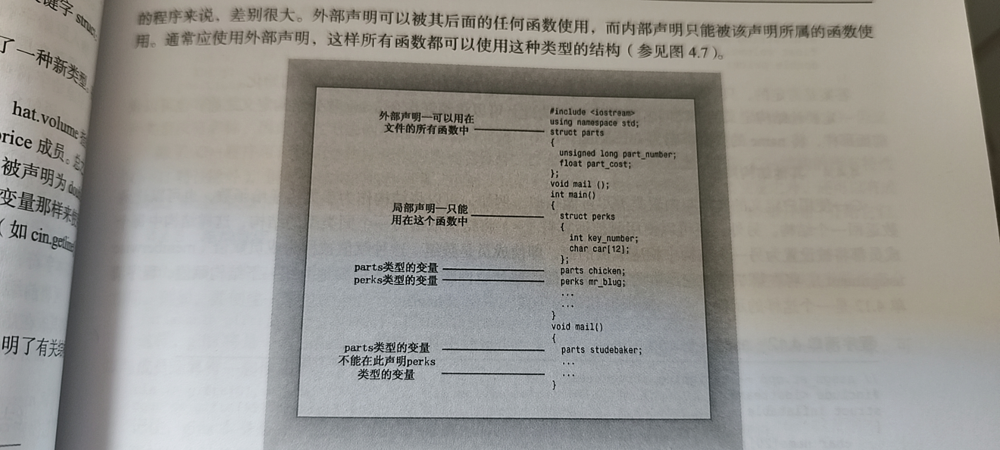

# C++学习

## 开始学习C++

### 进入C++

#### 第一个C++程序

- hello world程序
  ```cpp
  #include <iostream>
  int main(void)
  {
      std::cout << "hello world" << std::endl;
  }
  ```

#### main函数

- main函数的基本结构

  ```cpp
  int main()
  {
    语句
    return 0;
  }
  ```

  - `int main()` 叫做函数头
  - `{}` 叫做函数体
  - `int` 叫做返回值类型
  - `main()` 叫做函数名
  - `()` 叫做参数列表
  - `{}` 叫做函数体
  - `return 0;` 叫做返回语句，在 `main` 函数中可以省略不写，在现代C++中也推荐省略不写
- `函数头` 对函数与程序其他部分之间的接口进行总结
- `函数体` 是指出函数应做什么的计算机指令
- C++中完整的指令都称为 `语句` 。$\color{red}{在C++中，语句以分号结尾}$
- `return` 是返回语句它结束函数并提供一个值给调用它的程序

---

1. 作为接口函数：

- C++句法要求 `main` 的定义以函数头 `int main()` 开始
- 通常C++函数可以被其他函数激活或者调用
- `函数头` 描述了函数与调用它的程序之间的接口位于函数名前面的部分叫做函数的 `返回类型`,它表述了函数返回给调用它的程序的值的类型
- 函数名括号中的部分叫做 `形参列表` 或 `参数列表` 它描述了函数需要从调用它的程序接收什么信息
- 通常 `main` 函数被启动代码调用，而启动代码是由编译器添加到程序中的，是程序与操作系统之间的接口
- 一般情况我们可以将 `main` 函数看作是程序的 `入口点` 或者 `启动点`
- 通常 `main` 函数没有 `形参列表`
- 通常 `main` 函数的返回值类型是 `int`, `main` 函数的返回值不能是其他类型

2. 为什么 `main` 不能使用其他名称

- `main` 函数是C++程序的 `入口点` 或者 `启动点`,c++程序规定的入口函数，如果程序没有 `main` 函数，程序将会不完整，编译器会指出未定义 `main` 函数

#### C++注释

- C++注释分为单行注释和多行注释
- 单行注释以 `//` 开头，直到行尾结束
- 多行注释以 `/*` 开头，以 `*/` 结尾
- 注释中的内容不会被编译
- C++可以兼容C语言的注释风格

#### C++预处理器和iostream文件

- C++和C一样，也使用一个预处理器，该程序在进行主编译之前对源文件进行处理。不必进行特殊的操作来调用该预处理器，它会在编译程序时自动运行
- 预处理器的主要任务是处理 `#` 开头的行，这些行被称为 `预处理指令`
- 预处理指令告诉预处理器执行一些操作，例如包含其他文件、定义宏、条件编译等
- `iostream` 文件是C++标准库中的一个文件，它包含了 `iostream` 类的定义，这个类是C++中用于输入输出的类
- `iostream` 文件包含了 `cin` 和 `cout` 这两个对象，分别用于从键盘读取数据和向屏幕输出数据
- `iostream` 文件还包含了 `endl` 这一个特殊的字符，它用于在输出中插入一个换行符
- `iostream` 文件是C++中用于输入输出的标准库文件，当程序需要进行控制台输入输出操作时需要包含这个文件

#### 头文件名

- 像 `iostream` 这样的文件叫做 `包含文件` (由于它们被包含在其他文件中)，也叫做 `头文件` (由于它们被包含在文件的起始处)
- C++编译器自带了很多头文件，每个头文件都支持$\color{red}{一组特定的工具}$
- C语言的传统是，头文件使用扩展名 `h` ，将其作为一种通过名称标识文件类型的简单方式（如 `stdio.h`, `math.h`），但是C++的用法变了
- C++对老式的C拓展名保留的 `h` 而C++文件则没有拓展名
- 头文件命名约定
  - |  头文件类型  |      约定      |      示例      |                             说明                             |
    | :----------: | :------------: | :------------: | :----------------------------------------------------------: |
    | C++旧式风格 |   以.h 结尾   | `iostream.h` |                       C++程序可以使用                       |
    | C++新式风格 |    无扩展名    |  `iostream`  |                       C++程序可以使用                       |
    |  C 旧式风格  |   以.h 结尾   |   `math.h`   |                      C、C++程序可以使用                      |
    | C++ 新式风格 |    无扩展名    |  `iostream`  |            C++程序可以使用,使用 `namespace std`            |
    |  转化后的C  | 加上前缀 `c` |   `cmath`   | 在C++程序可以使用，可以使用不是C的特性，如 `namespace std` |

#### 名称空间

- 名称空间支持式式C++的一个特性，它可以避免命名冲突
- 名称空间可以看作成式一个容器，它可以包含变量、函数、类等，用于组织代码，避免命名冲突
- 在现代c++中使用含有名称空间的库时并不推荐使用 `using namespace` ,
  - 因为它会将名称空间中的所有名称都引入到当前作用域中，可能会导致命名冲突
  - 推荐的做法是在使用名称空间中的名称时，加上名称空间的前缀，例如 `std::cout` 而不是 `cout`

#### 使用cout进行C++输出

- `cout` 是C++标准库中的一个对象，它用于向屏幕输出数据
- `cout` 可以输出各种类型的数据，例如整数、浮点数、字符、字符串等
- `cout` 输出数据时，不会自动在数据之间插入空格，需要手动添加
- `cout` 输出数据后，不会自动在末尾插入换行符，需要手动添加换行符或使用 `std::endl`
- `std::endl` 是一个特殊的字符，它用于在输出中插入一个换行符,作用与 `\n` 相同
- 在 `windows` 系统中用C++输出中文需要使用 `windows.h` 库使用 `SetConsoleOutputCP(CP_UTF8);  // 设置控制台为UTF-8编码`
- 在 `linux` 系统中用C++输出中文需要使用 `locale.h` 库使用 `setlocale(LC_ALL, "zh_CN.UTF-8");  // 设置locale为UTF-8编码`

#### C++源码风格

- 每条语句占一行
- 每个函数都有一个开始的花括号和结束的花括号，这两个花括号独占一行
- 函数语句都都相对于花括号进行缩进
- 与函数名相关的圆括号没有空白

### C++语句

- C++程序是一组函数而每个函数又是一组语句
- 声明语句和赋值语句示例：
  ```cpp
  //carrots.cpp
  #include <iostream>
  int main(void)
  {
    int carrorts;
    carrorts = 25;
    std::cout << "I have ";
    std::cout << carrorts;
    std::cout << " carrorts."; 
    std::cout << std::endl;
    carrorts = carrorts - 1;
    std::cout << "Crunch, crunch, Now I have" << carrorts << " carrorts." << std::endl;
  }
  ```

#### 声明语句和变量

- 计算机是一个精确的有条理的机器。要将信息存储在计算机中，必须指出信息的存储位置和所需要的内存空间
- 声明语句就是用来告诉计算机存储信息的位置和所需的内存空间
- 声明语句的一般形式为：

  ```cpp
  类型 变量名;
  ```

  - 其中，`类型` 是指变量的数据类型，例如 `int`、`float`、`char` 等
  - 变量名是指变量的名称，它必须是一个合法的标识符，例如 `carrorts`、`pi`、`name` 等
  - 声明语句可以出现在函数的任何位置，但是通常放在函数的开头
  - 声明语句只能出现一次，不能重复声明
  - 声明语句可以在函数内部使用，称为局部变量，只能在函数体内访问
- 声明语句也可以在函数外部使用，称为全局变量，可以被多个函数访问

#### 赋值语句

- 赋值语句就是用来将一个值存储到计算机的内存中
- 赋值语句的一般形式为：

  ```cpp
  变量名 = 值;
  ```

  - 其中，`变量名` 是指要存储值的变量的名称
  - `=` 是赋值运算符，它将右边的值存储到左边的变量中
  - `值` 是指要存储到变量中的值- 赋值语句可以出现在函数的任何位置，通常在需要改变变量值时使用
- 赋值语句必须在变量声明之后使用，不能对未声明的变量赋值

### 其他C++语句

- c++输入语句示例
  ```cpp
  // getinfo.cpp
  #include<iostream>
  int main(void)
  {
    int carrots;
    std::cout << "How many carrots do you have?" << std::endl;
    std::cin >> carrots;
    carrots = carrots + 2; // 给 carrots 增加 2 个
    std::cout << "Now I have " << carrots << " carrots." << std::endl;
  }
  ```

#### 使用cin进行C++输入

- `std::cin >> 变量名` 用于从键盘输入数据并将其存储到变量中
- 其中，`变量名` 是指要存储输入数据的变量的名称
- C++将输出看作是一个流出的字符一样，而输入看作是一个流入的字符一样
- 在C++ io标准库中 `<<` 用于输出数据到屏幕，`>>` 用于从键盘输入数据并将其存储到变量中

#### 使用cout进行拼接

- `std::cout << 数据` 用于将数据输出到屏幕
- 其中，`数据` 是指要输出的数据
- 在C++ io标准库中可以将 `<<` 看作是拼接运算符，它将右边的数据拼接在左边的数据后面
- 拼接运算符可以用于拼接各种类型的数据，例如整数、浮点数、字符、字符串等
- 拼接运算符可以用于拼接多个数据，例如 `std::cout << "I have " << carrots << " carrots." << std::endl;`

#### 类简介

- 类是用户定义的一种数据类型
- 类定义描述的是是数据格式及其用法，而对象则是根据数据格式规范创建出来的实体
- 类描述指定了可对类执行的所有操作

#### 函数

- 函数是C++中的一个重要概念，它用于定义对象的行为
- 函数可以看作成是一个模板，它用于执行特定的任务
- 函数可以包含变量、语句、表达式等

1. 使用有返回值的函数

- 有返回值的函数将生成一个值，这个值可以被赋值给一个变量或用于其他表达式中使用如使用C/C++ `cmatg` 标准库中的 `sqrt` 函数
  - `x=sqrt(9.0);`
    - 这将计算 `9.0` 的平方根并将结果赋值给变量 `x`
    - 圆括号里面的内容是发给函数的参数，也是函数执行的必要条件，这里是 `9.0`
- 使用函数前需要编译器必须知道函数的返回值类型和参数类型
- 代码示例：
  ```cpp
  // sqrt.cpp
  #include<cmath>
  #include<iostream>
  int main(void)
  {
    double area;
    std::cout << "Enter the floor area, in square feet, of you home:";
    std::cin >> area;
    double side;
    side = sqrt(area);
    std::cout << "That's the equivalent of a" << side;
    std::cout << "feet to the side." << std::endl;
    std::cout << "How fascinating!" << std::endl;
  }
  ```
- `double` 类型的变量可以存储浮点数，例如 `3.14`、`2.71828` 等,`double`类型的覆盖范围比 `int`类型大

2. 使用无返回值的函数

- 无返回值的函数不会生成一个值，它只是执行特定的任务
- 代码示例：

  ```cpp
  // getinfo.cpp
  #include<iostream>
  int main(void)
  {
      int carrots;
      std::cout << "How many carrots do you have?" << std::endl;
      std::cin >> carrots;
      carrots = carrots + 2;
      std::cout << "Now I have " << carrots << " carrots." << std::endl;
  }
  ```
- 无返回值的函数可以在函数体中使用 `std::cout` 输出语句来显示结果
- 无返回值的函数可以在函数体中使用 `std::cin` 输入语句来获取用户输入
- 使用库函数

  - 库函数在C++库函数文件在
  - 在C++编译器编译时，编译器必须在库文件中搜索并链接库函数，至于搜索到那个函数将因编译器而异
  - 手动链接函数库在UNIX/LINUX系统中可以使用 `-lm` 选项来链接
    - 例如 `sqrt` 函数在 `cmath` 库函数中，所以在编译时需要链接 `cmath` 库函数
      - `g++ -o sqrt sqrt.cpp -lm`
  - 只包含头文件可以提供原型，但不一定会导致编译器正确搜索库文件
- 函数变体

  - 函数变体是指函数的不同版本，它们具有相同的名称但不同的参数类型或数量
  - 例如 `sqrt` 函数在 `cmath` 库函数中，有一个版本接受 `double` 类型的参数，还有一个版本接受 `float` 类型的参数
  - 函数变体可以用于处理不同类型的数据，例如 `sqrt(9.0)` 计算 `9.0` 的平方根，而 `sqrt(9.0f)` 计算 `9.0f` 的平方根
- 用户定义的函数

  - 标准C库提供了140多个预定的函数。如果其中函数可以满足要求这我们应该使用标准C库中的函数，但用户经常需要编写自己的函数，尤其在设计类的情况下
  - 示例：

    ```cpp
    // ourfunc.cpp
    #include<iostream>
    void simon(int n); //函数原型声明
    int main(void){
      simon(3);       // call the simon() function
      std::cout << "Pick an integer: ";
      int count;
      std::cin >> count;
      simon(count);   // call it again
      std::cout << "Done!" << std::endl;
      return 0;

    }
    void simon(int n){  //定义函数体
      std::cout << "Simon says touch your toes " << n << " times." << std::endl;
    }
    ```

    - 示例说明：
      - 程序首先调用 `simon(3)` 函数，输出 `Simon says touch your toes 3 times.`
      - 然后程序等待用户输入一个整数，假设用户输入 `5`
      - 程序再次调用 `simon(5)` 函数，输出 `Simon says touch your toes 5 times.`
      - 最后程序输出 `Done!`

1. 函数格式

   - 标准C++函数格式如下：

     ```cpp
     type functionname(parameter_list){
       statements;
     }
     ```
   - 注意，C++不允许函数定义嵌套在其他函数中，每个函数都是独立的，所有函数创建都时平等的

     - 
2. 函数头

- 函数头包含函数的返回值类型、函数名和参数列表
- 例如 `void simon(int n)` 是一个无返回值的函数，函数名是 `simon`，参数列表是 `int n`
- 函数头的作用是告诉编译器函数的返回值类型、函数名和参数列表，以便编译器可以正确地编译函数
- 函数头的格式如下：

  ```cpp
  type functionname(parameter_list);
  ```

  在上例中的 `void simon(int n);` 就是函数原型，它告诉编译器 `simon` 函数是一个无返回值的函数，函数名是 `simon`，参数列表是 `int n`
- 定义有返回值的函数

  - 在函数头中指出函数的返回类型，在函数体中使用 `return` 语句返回值
  - 案例

    ```cpp
    //convert.cpp
    #include<iostream>
    int stonetolb(int n); //函数原型声明
    int main(void){
      int stone;
      std::cout << "Enter the weight in stone: ";
      std::cin >> stone;
      int pounds = stonetolb(stone);
      std::cout << stone <<" stone=";
      std::cout << pounds << " pounds.";
    }
    int stonetolb(int n){ //定义函数体
      return n * 14;
    }
    ```

    - 示例说明：
      - 程序首先等待用户输入一个整数，假设用户输入 `10`
      - 程序调用 `stonetolb(10)` 函数，返回 `140`
      - 程序输出 `10 stone=140 pounds.`
    - 在程序运行过程
      - 程序执行 `int pounds = stonetolb(stone);` 时，将 `10` 作为参数传递给 `stonetolb` 函数
      - `stonetolb` 函数将 `10` 乘以 `14` 并返回 `140`
      - 程序将 `140` 赋值给 `pounds` 变量
      - 程序输出 `10 stone=140 pounds.`
      - 程序结束
  - 函数的特性

    - 有函数体
    - 有参数列表
    - 有返回值类型
    - 需要一个原型来告诉编译器函数的返回值类型、函数名和参数列表

3. 在多函数程序中使用 `using` 编译指令

- 可以在程序中使用 `using namespace std;` 来告诉编译器使用 `std` 命名空间中的所有函数
- 例如 `std::cout` 可以写为 `cout`
- 例如 `std::cin` 可以写为 `cin`
- 例如 `std::endl` 可以写为 `endl`
- 案例

  ```cpp
  // ourfuncl.cpp
  #include<iostream>
  using namespace std;
  void simon(int n) // 声明函数原型
  int main(void){
    simon(3);
    cout << "Pick an integer: ";
    int count;
    cin >> count;
    simon(count);
    cout << "Done!" << endl;
  }
  void simon(int n){ // 定义函数体
    cout << "Simon says touch your toes " << n << " times." << endl;
  }
  ```

  - 当前的通行理念是，只让函数访问名称空间 `std` 的函数访问它是更好的选择
  - 如果只让 `main` 函数访问名称空间 `std` 中的函数那只需将 `using namespace std;` 放在 `main` 函数中
- 让程序访问名称空间的方法有很多种，下面的是其中4种：

  1. 将 `using namespace std;` 放在函数定义之前，让文件中的所有函数都可以访问 `std` 命名空间中的函数
  2. 将 `using namespace std;` 放在 特定 函数中，让 特定 函数可以访问 `std` 命名空间中的函数
  3. 在特定的函数中使用类似 `using std::cout;` 这样的编译命令，能让该函数使用名称空间中指定的元素
  4. 完全不使用编译命令 `using` , 而在需要使用名称空间 `std` 中元素时，使用前缀 `std::` ,如 `std::cout` 、 `std::cin` 、 `std::endl` 等 这个方法是最安全的，因为它不会造成命名冲突

## 处理数据

### 简单变量

- 程序通常都需要存储信息，如用来进行计算的数值，Goole股票当前的价格。为把信息存储到计算机,程序必须记录3个基本属性

  1. 信息存在哪里
  2. 要存什么值
  3. 存储何种类型信息
- 声明变量的语句如下：

  ```cpp
  type variable_name;
  ```

  - 例如 `int age;` 声明了一个名为 `age` 的整数变量
  - 例如 `double price;` 声明了一个名为 `price` 的双精度浮点数变量
  - 例如 `char initial;` 声明了一个名为 `initial` 的字符变量
  - 例如 `bool name;` 声明了一个名为 `name` 的布尔变量

#### 变量名

- C++提倡使用一定含义的变量名，如差路费将其命名为 `cost_of_trip` 或 `costOfTrip`
- C++变量名命名规则：
  - 在名称中只能使用字母字符、数字和下划线
  - 名称的第一个字符不能是数字
  - 区分大写字母和小写字母。一般常量用大写字母表示，如 `const int MAX = 100;`
  - 不能将C++关键字用做变量名
  - 以两个下划线或下滑线和大写字母开头的名称均被保留给实现（编译器及其使用的资源）使用，以一个下划线开头的名称被保留给实现，用作全局标识
  - C++对于名称长度没有限制，名称中所有字段都有意义，但有些编译器对名称长度有限制，所以一般建议名称不超过15个字符
- 驼峰命名法和蛇形命名法
  - 驼峰命名法：每个单词的首字母大写，其他字母小写，如 `CostOfTrip`
  - 蛇形命名法：每个单词之间用下划线隔开，所有字母小写，如 `cost_of_trip`
- 无效的变量名和有效变量名示例：
  ```
    int 1data; // 无效的变量名，因为以数字开头
    int data1; // 有效变量名
    int cost_of_trip; // 有效变量名
    int costOfTrip; // 有效变量名
    int max; // 有效变量名
    int MAX; // 有效变量名
    int _max; // 有效变量名
    int if; // 无效的变量名，因为 `if` 是C++关键字
    int cost-of-teip; //无效变量名
  ```

#### 整型

- 整型就是没有小数部分的整数，如 `10` 、 `-10` 、 `0` 等，可以直接理解为整数
- 整数有很多如果将无限大的整数看作很大，则不肯用有限的计算机内存表示所有整数，因此语言只能表示整数的一个子集
- C++提供好几种整型，这样便能根据程序的要求选择合适的整型
- C++不同的整型使用不同的内存量来存储整数，使用的内存越大可以表示的整数越大
- 整型 `short` 、 `int` 、 `long` 、 `long long`

  - `short` ：至少16位（通常2字节）
  - `int` ：至少16位，通常32位（4字节）
  - `long` ：至少32位，在32位系统通常4字节，64位系统可能4或8字节
  - `long long` ：至少64位（通常8字节）
- `short` 、 `int` 、 `long` 、 `long long` 四种数据类型都是有符号的，即可以表示负数
- 无符号整型：

  - `unsigned short` ：2字节，总是16位
  - `unsigned int` ：4字节，至少32位
  - `unsigned long` ：4字节或8字节，取决于编译器，总共有32位或64位,具体取决于操作系统
  - `unsigned long long` ：8字节，至少64位
- 如果要知道系统整数的最大长度，可以用C++工具来检测长度，如 `sizeof(int)` 、 `sizeof(long)` 、 `sizeof(long long)` 等
- climts头文件中包含了关于整型限制的信息，如 `INT_MAX` 、 `INT_MIN` 、 `UINT_MAX` 等
- 定义整型变量及其检测系统整数的最大长度示例

  ```cpp
  // limits.cpp
  #include<iostream>
  #include<limits>
  int main(void){
      int n_int = INT_MAX;
      short n_short = SHRT_MAX;
      long n_long = LONG_MAX;
      long long n_llong = LLONG_MAX;
      std::cout << "int is " << sizeof(int)<<  " bits" << std::endl;
      std::cout << "short is " << sizeof n_short<< " bits" << std::endl;
      std::cout << "long is " << sizeof n_long << " bits" << std::endl;
      std::cout << "long long is " << sizeof n_llong << " bits" << std::endl;
      std::cout << std::endl;
      std::cout << "Maxium int values:"<< std::endl;
      std::cout << "int: " << n_int << std::endl;
      std::cout << "short: " << n_short << std::endl;
      std::cout << "long: " << n_long << std::endl;
      std::cout << "long long: " << n_llong << std::endl;

      std::cout << "Minium int values = "<< INT_MIN << std::endl;
      std::cout << "Bits per byte = " << CHAR_BIT << std::endl;

      return 0;
  }
  ```

  - 程序的 `sizeof` 运算符指出了每个整型变量占用的字节数
  - `limits` 头文件中包含了关于整型限制的信息，如 `INT_MAX` 、 `INT_MIN` 、 `UINT_MAX` 等
- `limits` 中的符号常量

  - |    符号常量    |            表示            |
    | :------------: | :-------------------------: |
    |  `CHAR_BIT`  |         char的位数         |
    |  `CHAR_MAX`  |        char的最大值        |
    |  `CHAR_MIN`  |        char的最小值        |
    |  `SHAR_MAX`  |    signed char 的最大值    |
    |  `SHAR_MIN`  |    signed char 的最小值    |
    | `UCHAR_MAX` |   unsigned char 的最大值   |
    | `UCHAR_MIN` |   unsigned char 的最小值   |
    |  `SHRT_MAX`  |    signed short 的最大值    |
    |  `SHRT_MIN`  |    signed short 的最小值    |
    | `USHRT_MAX` |   unsigned short 的最大值   |
    |  `INT_MAX`  |     signed int 的最大值     |
    |  `INT_MIN`  |     signed int 的最小值     |
    |  `UINT_MAX`  |    unsigned int 的最大值    |
    |  `LONG_MAX`  |    signed long 的最大值    |
    |  `LONG_MIN`  |    signed long 的最小值    |
    | `ULONG_MAX` |   unsigned long 的最大值   |
    | `LLONG_MAX` |  signed long long 的最大值  |
    | `LLONG_MIN` |  signed long long 的最小值  |
    | `ULLONG_MAX` | unsigned long long 的最大值 |
- 符号常量

  - C++的 `climits` 头文件里面有象 `#define INT_MAX 2147483647` 这样的符号常量，这些符号常量定义了整型的最大值和最小值
    - ``
- 初始化

  - 变量可以在定义的时候初始化，如 `int n = 10;`
  - 变量初始化是第一次给变量赋值的时候，如 `int n = 10;` 是初始化，而 `n = 20;` 不是初始化
  - `int n = 10;` 这个初始化的来源于C语言，C++兼容C语言的初始化语法，除了 `type variable_name = value;` 之外，C++在C11标准中还引入了列表初始化语法，如 `int n{10};` 、 `int n{10,20};` 等
    - 注意：$\color{yellow}{如果不对变量进行初始化，那么变量的值是不确定的，这意味着该变量的值将是内存中该变量的旧值}$
    - `#define` 和 `#include` 一样都是预处理指令，预处理指令在编译之前执行，预处理指令以 `#` 开头
    - `#define` 指令源于C语言，但是C++有更好的创建常量的方法，如 `const int n = 10;` 、 `constexpr int n = 10;` 等
    - 如果要设计一个头文件让C和C++都能使用，那么必须使用 `#define` 指令来定义常量

#### 无符号类型

- 无符号类型的整型只能存储非负数，但是无符号类型的整型的最大值是有符号类型的整型的最大值的两倍左右（对于相同位数的整型）
- 无符号类型的整型的最小值是0，而有符号类型的整型的最小值是$-2^{n-1}$，其中$n$是整型的位数
- 无符号类型的整型变量声明与有符号类型的整型变量声明类似，只是在类型名前面添加了 `unsigned` 关键字，如 `unsigned int n;`
- 示例：

  ```cpp
  //exceed.cpp
  #include<iostream>
  #define ZERO 0
  #include<climits>
  int main(void)
  {
      short int sam = SHRT_MAX;
      unsigned short sue = sam;
      std::cout << "Sam has " << sam << " dollars and ";
      std::cout << "Sue has " << sue << " dollars." << std::endl
                <<"Add $1 to each account." << std::endl << "Now";
      sam = sam +1;
      sue = sue +1;
      std::cout << "Sam has " << sam << " dollars and Sue has " << sue;
      std::cout<< " dollars deposited.\nPoor Sam!";
      sam = ZERO;
      sue = ZERO;
      std::cout << "Sam and Sue have " << sam << " and " << sue << " dollars and Sue has" << sue;
      std::cout << " dollars deposited." << std::endl;
      std::cout << "Take $1 from each account." << std::endl << "Now ";
      sam = sam - 1;
      sue = sue - 1;
      std::cout << "Sam has " << sam << " dollars and Sue has " << sue;
      std::cout << " dollars deposited." << std::endl << "Lucky Sue!" << std::endl;
  }
  ```

  - 程序运行后我们会发现一但 整型超出了最大值，那么整型就会回绕到最小值,如果超过了最小值，那么整型就会回绕到最大值
  - 写C和C++程序时，应该注意整型的范围，避免整型超出范围
  - 向上述代码出去的情况被成为 `整型回绕`或者 `整型溢出` ，在写代码时应该注意避免整型超出范围
- 选则整数类型
- 选择整数类型时，应该考虑以下几个因素：

  - 整数的范围是否足够大
  - 整数的范围是否足够小
  - 整数是否需要是无符号的
  - 整数是否需要是有符号的
- 一般情况下 `int` 类型是最常用的整数类型，它的范围是$-2^{31}$到$2^{31}-1$，即$-2147483648$到$2147483647$

#### 整型字面量

- `字面量` 是显示的书写常量，如 `10` 、 `20` 等
- C++与C相同，有三种不同的计数方式来书写常量：

  - 十进制计数方式
  - 十六进制计数方式
  - 八进制计数方式'
- 如果前两位是 `0x` 或 `0X` ，那么后面的数字就是十六进制数
- 如果前两位是 `0` ，那么后面的数字就是八进制数
- 示例：

  ```cpp
  //hexoct1.cpp
  #include<iostream>
  int main(void){
      int chest =42;
      int waist = 0x42;
      int inseam = 042;
      std::cout << "chest = " << chest << std::endl;
      std::cout << "waist = " << waist << std::endl;
      std::cout << "inseam = " << inseam << std::endl;
  }
  ```

  - 程序运行后我们会发现，`chest` 、 `waist` 、 `inseam` 这三个变量的值分别是42、66、34
  - 这三个变量的值分别是42、66、34，这说明C++可以使用三种不同的计数方式来书写常量
- 示例：

  ```cpp
  //hexoct2.cpp
  #include<iostream>
  int main(void){
      int chest =42;
      int waist = 42;
      int inseam = 42;
      std::cout << "Monsieur cuts a striking figure!" << std::endl;
      std::cout << "chest = " << chest << " (decimal for 42)" << std::endl;
      std::cout << std::hex;
      std::cout << "waist = " << waist << " (hexadecimal for 42)" << std::endl;
      std::cout << std::oct;
      std::cout << "inseam = " << inseam << " (octal for 42)" << std::endl;

  }
  ```

  - 程序运行后我们会发现，`chest` 、 `waist` 、 `inseam` 这三个变量的值分别是42、2a、52
  - 这三个变量的值分别是42、2a、52，这说明C++可以使用三种不同的计数方式来书写常量
  - std::hex 、 std::oct 、 std::dec 这三个流操作符可以用来切换输出的进制数

##### C++如何确定常量的类型

- 程序的声明可以将特定的变量类型告诉给C++编译器
- 像 `std::cout << 1492;` 这样的语句C++会将 `1492` 视为 `int` 类型，如果这个值很大，那么C++会将 `1492` 视为 `long int` 类型,C++会根据这个值的大小来确定它的类型
- 如果要让C++将一个具体的值是为 `long int` 类型，那么可以在这个值后面添加一个 `L` 或 `l` ，如 `1492L` 或 `1492l`，其余的类型使用类似的方法，如 `1492UL` 或 `1492ul`
- C++类型对照表
  - |            类型            |        后缀        |
    | :------------------------: | :----------------: |
    |          `int`          |     `无后缀`     |
    |      `unsigned int`      |   `U` 或 `u`   |
    |        `long int`        |   `L` 或 `l`   |
    |   `long unsigned int`   |  `UL` 或 `ul`  |
    |     `long long int`     |  `LL` 或 `ll`  |
    | `long long unsigned int` | `ULL` 或 `ull` |
- 一般 十六进制适合表示大的数，而八进制适合表示小的数
- 一般对于无符号的整数，应该使用十六进制或八进制来表示

#### char 类型：字符和小数

- `char` 类型属于整型类型，它可以存储字符和小数
- `char` 类型是为存贮字符而设计的，它的范围是$-128$到$127$，即$-2^7$到$2^7-1$，也就是 ASCII 码表中的字符
- 在 `ASCII` 码表中，`0` 到 `9` 对应的字符是 `48` 到 `57`，`A` 到 `Z` 对应的字符是 `65` 到 `90`，`a` 到 `z` 对应的字符是 `97` 到 `122`
- `ASCII` 对照表：
  

  - 这里只取前面的部分，因为后面的部分是扩展的 `ASCII` 码表，不是所有的字符都在 `ASCII` 码表中
- 示例

  ```cpp
  // chartye.cpp
  #include<iostream>
  int main(void){
      char ch;
      std::cout << "Enter a character: " << std::endl;
      std::cin >> ch;
      std::cout << "Hla!";
      std::cout << "Thank you for the " << ch << " character." << std::endl;
  }
  ```

  - 程序运行后我们会发现，当我们输入一个字符时，程序会将这个字符存储在 `ch` 变量中，然后输出这个字符
- 在这个字符后会发现输出的不是字符编码，而是输入的字符内容
- 这是因为 `std::cout` 会将 `char` 类型的变量视为字符，而不是整数
- 如果要将 `char` 类型的变量视为整数，那么可以使用 `int(ch)` 来将 `char` 类型的变量转换为整数,或者使用 `cout.put(ch)` 来将 `char` 类型的变量输出为字符
- 示例

  ```cpp
  // morechar.cpp
  #include<iostream>
  int main(void){
      char ch;
      int i = ch;
      std::cout << "Enter a character: " << std::endl;
      std::cin >> ch;
      std::cout << "The ASCII code for " << ch << " is " << i << std::endl;
      std::cout << "Add one to the character code:" << std::endl;
      ch = ch + 1;             // change character code in ch
      i = ch;                  // save new character code in i
      std::cout << "The ASCII code for " << ch << " is " << i << std::endl;

      // using the cout.put() member function to display a char
      std::cout << "Displaying char ch using cout.put(ch): ";
      std::cout.put(ch);

      // using cout.put() to display a char constant
      std::cout.put('!');

    std:: cout << std::endl << "Done" << std::endl;
      return 0;
  }
  ```

  - 程序运行后我们会发现，当我们输入一个字符时，程序会将这个字符存储在 `ch` 变量中，然后输出这个字符的编码
  - 然后程序会将这个字符的编码加一，然后输出这个字符的编码
  - 最后程序会将这个字符的编码转换为字符，然后输出这个字符
- cout.put() 成员函数

  - `cout.put(ch)` 成员函数可以将 `char` 类型的变量输出为字符
  - `cout.put()` 成员函数提供了一种将字符输出为字符的方法，而不是将字符输出为整数

##### char 字面值

- `char` 字面值是用单引号括起来的字符，如 `'a'` 、 `'A'` 、 `'1'` 等
- `char` 字面值可以直接赋值给 `char` 类型的变量
- 有一些字符不能通过键盘输入到程序程序中如 换行符
- 这些字符可以通过 `char` 字面值来表示，如 `'\n'` 、 `'\t'` 等
- 像 `'\n'` 、 `'\t'` 等这些字符被称为 `转义字符`，它们可以用来表示一些特殊的字符
- C++转义序列的编码

  - |  字符名称  | ASCII符号 | C++代码 | 十进制ASII码 | 十六进制ASCII码 |
    | :--------: | :-------: | :-----: | :----------: | :-------------: |
    |   换号符   |  NL(LF)  | `\n` |      10      |      0x0A      |
    | 水平制表符 |  HT(TAB)  | `\t` |      9      |      0x09      |
    | 垂直制表符 |    VT    | `\v` |      11      |      0x0B      |
    |   退格符   |    BS    | `\b` |      8      |      0x08      |
    |    回车    |    CR    | `\r` |      13      |      0x0D      |
    |   振铃符   |    BEL    | `\a` |      7      |      0x07      |
    |   反斜杠   |     \     | `\\` |      92      |      0x5C      |
    |    问号    |     ?     | `\?` |      63      |      0x3F      |
    |   单引号   |     '     | `\'` |      39      |      0x27      |
    |   双引号   |     "     | `\"` |      34      |      0x22      |
- 示例:

  ```cpp
  //bondini.cpp 
  #include<iostream>
  int main(void){
      std::cout << "\aOpertion \" HyperHyper\" is now activated! \n";
      std::cout << "Enter your agent code:________\b\b\b\b\b\b\b\b";
      long code;
      std::cin >> code;
      std::cout << "\aYou entered " << code << "···\n";
      std::cout << "\aCode verified! Proceed with Plan Z3!\n";
  }
  ```

  - 程序运行后会出现以下内容：
    ```shell
    Opertion " HyperHyper" is now activated!
    Enter your agent code:________
    ```
  - 光标会闪烁在 `________` 这个位置，等待用户输入
  - 用户输入一个整数后，程序会将这个整数存储在 `code` 变量中，然后输出这个整数
  - 假设输入的是 `1234567890`，那么程序会输出以下内容：
    ```shell
    You entered 1234567890···
    Code verified! Proceed with Plan Z3!
    ```

##### 通用字符名

- 通用字符名是一种特殊的字符，它可以用来表示一些特殊的字符
- 通用字符名的格式是 `\uXXXX` 或 `\UXXXXXXXX`，其中 `XXXX` 或 `XXXXXXXX` 是一个十六进制数
- 例如， `\u0041` 表示字符 `A`， `\U00000041` 也表示字符 `A`
- 通用字符名可以用来表示一些特殊的字符，如 `\u00A9` 表示版权符号 `©`
- 通用字符名可以用来输出一些键盘上不能直接输入的字符，如 `\u2022` 表示 bullet 符号 `•`
- 示例

  ```cpp
  // universal_character.cpp
  #include<iostream>
  int main(void){
      char ch = '\U00000041';
      std::cout << "hello \u2022 world" << std::endl;
      std::cout << "The character " << ch << " has the code " << (int)ch << std::endl;
  }
  ```

  - 程序运行后会输出以下内容：
    ```shell
    hello • world
    The character A has the code 65
    ```
- C++的"通用编码名" 不是通用编码，它只是一种特殊的字符表示方法
- 支持 `Unicode` 的编译器可以识别 `\uXXXX` 或 `\UXXXXXXXX` 格式的通用字符名

  - 例如， `\u00A9` 表示版权符号 `©`
  - `\u2022` 表示 bullet 符号 `•`
  - `ASCII` 码是 `UniCodee` 的一个子集
- 在不同系统中，通用字符名的编码可能会不同

  - 例如，在 `Windows` 系统中， `\u00A9` 表示版权符号 `©`，而在 `Linux` 系统中， `\u00A9` 表示 `A` 字符

##### signed char 和 unsigned char 类型

- `char` 与 `int` 类型不同的是， `char` 类型的符号性是由编译器实现决定的，gcc编译器默认情况下 `char` 类型是有符号的，但可以通过编译器选项改变这种行为
- 如果需要 `char` 类型有某种特定行为，则可以显示的将类型声明为 `signed char` 或 `unsigned char`

  - 如

  ```cpp
   signed char ch1 = -128;
   unsigned char ch2 = 255;
  ```
- 什么是特定行为

  - `char` 类型的行为可能因编译器和硬件环境存在差异，这就是所谓的 “特定行为”

  1. `char` 的不确定性: `char` 类型在标准中没有明确规定是 `signed`（有符号，取值范围通常是 - 128 到 127）还是unsigned（无符号，取值范围通常是 0 到 255），编译器会根据硬件特性等因素来决定其默认的符号属性。
  2. 显式指定的意义：如果开发者需要 `char` 具有确定的行为（比如必须是无符号，用于表示 0 到 255 的 ASCII 值范围；或者必须是有符号，用于某些数值计算场景），就可以显式地将其声明为 `signed char` 或 `unsigned char` ，这样能确保代码在不同编译器、不同硬件环境下行为一致，避免因默认属性差异导致的 bug。

##### wchar_t 类型

- 如果出现处理的字符集无法用8位字节表示的字符C++提供了两种处理方法：

  1. 如果大型字符集是是实现的基本字符集，则编译器厂商可以将 `char` 定义为16位的字节或者更长的字节，也就是说部分编译器的 `char` 类型可以表示16位的字符
  2. 使用 `wchar_t` 类型，`wchar_t` 类型是一种整数类型，`wchar_t` 类型有足够的空间可以表示系统中使用的最大的扩展字符集
- `cin` 和 `cout` 将输入输出看作是char流，则不适用与处理 `wchar_t` 类型的字符
- C++ 在 `iostream` 头文件中定义了 `wcin` 和 `wcout` 方法用于处理 `wchr_t` 类型
- 示例

  ```cpp
  // wchar_t_and_io.cpp
  #include <iostream>
  #include <io.h>
  #include <fcntl.h>

  int main() {
      _setmode(_fileno(stdout), _O_U16TEXT);
      _setmode(_fileno(stdin), _O_U16TEXT);

      std::wcout << L"请输入一个中文: ";
      wchar_t ch;
      std::wcin >> ch;
      std::wcout << L"输入内容为: " << ch << std::endl;
  }
  ```

  - 程序运行后会出现以下内容：
    ```shell
    请输入一个中文: 中
    输入内容为: 中
    ```
  - 这里因为要输出的是中文，而 `cout` 和 `wcout`是有了一点差别的所以设置为中文输出的方法是不一样的
    - `wcout` 会自动将 `wchar_t` 类型的字符转换为宽字符输出，而 `cout` 则不会
    - 所以在使用 `wcout` 输出 `wchar_t` 类型的字符时，需要在字符前加上 `L` 前缀，以示区分
    - 而在使用 `cout` 输出 `wchar_t` 类型的字符时，需要使用 `wcout` 方法，否则会出现乱码
  - wcout在windows系统中输出中文需要使用C++的 `io.h` 库中的 `_setmode` 函数来设置输出模式为宽字符模式和 `fcntl.h` 库中的 `_fileno` 函数来获取文件描述符
    - 设置为中文的方法是只要在程序开始时调用 `_setmode(_fileno(stdout), _O_U16TEXT);` 和 `_setmode(_fileno(stdin), _O_U16TEXT);` 即可
  - wcout在Linux系统中使用输出中文需要使用C++的 `locale` 库中的 `setlocale` 函数来设置 locale 为 `zh_CN.UTF-8`
    - 设置为中文的方法是只要在程序开始时调用 `std::locale::global(std::locale("zh_CN.UTF-8"));` 即可
- 示例:

  ```cpp
  #include<iostream>
  #include<locale.h>
  int main(void){
    std::locale::global(std::locale("zh_CN.UTF-8"));
    std::wcout << L"请输入一个中文: ";
    wchar_t ch;
    std::wcin >> ch;
    std::wcout << L"输入内容为: " << ch << std::endl;
  }
  ```

##### char16_t 类型和和 chart32_t 类型

- `char16_t` 类型和 `char32_t` 类型是 C++11 引入的新类型，用于表示 `UTF-16` 和 `UTF-32` 编码的字符
- 这两个类型分别占用 16 位和 32 位，分别对应 `UTF-16` 和 `UTF-32` 编码的字符
- 示例

  ```cpp
  // char16_t_and_char32_t.cpp
  #include <iostream>
  #include<io.h>
  #include<fcntl.h>
  int main() {
       _setmode(_fileno(stdout), _O_U16TEXT);
      char16_t ch16 = u'中';
      char32_t ch32 = U'中';

      wprintf(L"char16_t 类型的字符: %lc\n", ch16);
      wprintf(L"char32_t 类型的字符: %lc\n", ch32);
  }
  ```

  - 程序运行后会出现以下内容：

    ```shell
    char16_t 类型的字符: 中
    char32_t 类型的字符: 中
    ```
  - 使用C语言的 `wprintf` 函数进行输出可以直接输出 `char16_t` 类型的字符和 `char32_t` 类型的字符
  - 使用C++的wcout进行输出需要进行类型转换，将 `char16_t` 类型的字符转换为 `wchar_t` 类型，将 `char32_t` 类型的字符转换为 `wchar_t` 类型或者把 `U` 前缀改为 `L` 前缀
  - 示例

    ```cpp
    // char16_t_and_char32_t_2.cpp
    #include <iostream>
    #include<io.h>
    #include<fcntl.h>
    int main() {
         _setmode(_fileno(stdout), _O_U16TEXT);
        char16_t ch16 = u'中';
        char32_t ch32 = U'中';
        char16_t ch16_2 = L'中';
        char32_t ch32_2 = L'中';
        wprintf(L"char16_t 类型的字符: %lc\n", ch16_2);
        wprintf(L"char32_t 类型的字符: %lc\n", ch32_2);

        wprintf(L"char16_t 类型的字符: %lc\n", (wchar_t)ch16);
        wprintf(L"char32_t 类型的字符: %lc\n", (wchar_t)ch32);

    }
    ```

    - 程序运行后会出现以下内容：
      ```shell
      char16_t 类型的字符: 中
      char32_t 类型的字符: 中
      char16_t 类型的字符: 中
      char32_t 类型的字符: 中
      ```

#### bool 类型

- `bool` 类型是 `ANSI/ISO C++` 标准引入的，表示布尔值即 `true` (真)和 `false` (假)
- `bool` 类型属于整数类型，占用 1 个字节，值为 `0` 或 `1`

  - `0` 表示 `false`
  - `1` 表示 `true`
- 定义 `bool` 类型的变量时，需要在变量名前加上 `bool` 关键字
- 示例

  ```cpp
  // bool_type.cpp
  #include <iostream>
  int main() {
      bool b1 = true;
      bool b2 = false;
      std::cout << "b1: " << b1 << std::endl;
      std::cout << "b2: " << b2 << std::endl;
      std::cout << std::boolalpha;
      std::cout << "b1: " << b1 << std::endl;
      std::cout << "b2: " << b2 << std::endl;
  }
  ```

  - 程序运行后会出现以下内容：
    ```shell
    b1: 1
    b2: 0
    b1: true
    b2: false
    ```
  - 这里可以看到 `b1` 和 `b2` 的值分别为 `1` 和 `0`，而 `b1` 和 `b2` 的值分别为 `true` 和 `false`
  - `std::boolalph` 是一个 `iostream` 库中的函数，用于将 `bool` 类型的变量输出为 `true` 或 `false` 而不是 `1` 或 `0`

### const 限定符

- `const` 限定符用于修饰变量，将其值设置为常量，不能被修改
- 示例

  ```cpp
  // const_qualifier.cpp
  #include <iostream>
  int main() {
      const int a = 10;
      std::cout << "a: " << a << std::endl;
      // a = 20; // 编译错误，不能修改常量的值
  }
  ```

  - 程序运行后会出现以下内容：
    ```shell
    a: 10
    ```
  - 将// a = 20; 取消注释会导致编译错误，因为 `a` 是一个常量，不能被修改
  - 常量可以在定义时初始化，也可以在后续的代码中初始化，但是只能初始化一次
  - 注意 `ANSI C` 的 `const` 限定符是从C++借鉴过去的而不是C++向后兼容C语言的 `const` 限定符
  - 一般情况可以使用 `const` 限定符修饰的变量来设置数组的长度

### 浮点数

- 浮点数用于表示实数，可以简单理解为小数
- 一般情况我们认为浮点数描述的数值比整型要更全
- 浮点数存在精度损失
- C++里面的浮点数也是和实数里面的一个一个子集
- 一般C++浮点数描述的是一个近似值

#### 书写浮点数

- C++书写浮点数有两种方式，即小数形式和指数形式
  1. 小数形式
     - 例如：`3.14`、`-0.5`、`123.456` 等
  2. 指数形式
     - 例如：`2.52e+8`、`8.33E-4`、`7E5` 等

#### 浮点类型

- C++ 里面有三种浮点数类型，即 `float` 类型、 `double` 类型和 `long double` 类型
- `float` 类型占用 4 个字节，用于表示单精度浮点数
- `double` 类型占用 8 个字节，用于表示双精度浮点数
- `long double` 类型占用 16 个字节，用于表示扩展精度浮点数
- 一般情况下，我们使用 `double` 类型来表示浮点数，因为 `double` 类型的精度要比 `float` 类型高
- `long double` 类型的精度要比 `double` 类型高，一般情况下我们不会使用 `long double` 类型来表示浮点数
- 对于 `float` 、`double` 、 `long double` 类型有效位数要求

  - `float` 类型有效位数为 6 位，
  - `double` 类型有效位数为 15 位
  - `long double` 类型有效位数为 18 位
  - 但是事实上 `float` 有效位数至少是 32 位，`double` 有效位数至少是 48 位，`long double` 有效位数至少是 80、90或 128 位
- 这三种类型的指数有效范围指数是-37~37
- 在 `float.h` 头文件中可以找到 `float` 、`double` 、 `long double` 类型的有效位数和指数有效范围
- 示例

  ```cpp
  // float_scope.cpp
  #include<iostream>
  #include<float.h>
  int main(void){
      int float_digits = FLT_DIG;
      int dbl_digits = DBL_DIG;
      int ldbl_digits = LDBL_DIG;
      std::cout << "float_digits: " << float_digits << std::endl;
      std::cout << "dbl_digits: " << dbl_digits << std::endl;
      std::cout << "ldbl_digits: " << ldbl_digits << std::endl;
      int float_mant = FLT_MANT_DIG;
      int dbl_mant = DBL_MANT_DIG;
      int ldbl_mant = LDBL_MANT_DIG;
      std::cout << "float_mant: " << float_mant << std::endl;
      std::cout << "dbl_mant: " << dbl_mant << std::endl;
      std::cout << "ldbl_mant: " << ldbl_mant << std::endl;
      int float_max = FLT_MAX_10_EXP;
      int dbl_max = DBL_MAX_10_EXP;
      int ldbl_max = LDBL_MAX_10_EXP;
      std::cout << "float_max: " << float_max << std::endl;
      std::cout << "dbl_max: " << dbl_max << std::endl;
      std::cout << "ldbl_max: " << ldbl_max << std::endl;
      int float_min = FLT_MIN_10_EXP;
      int dbl_min = DBL_MIN_10_EXP;
      int ldbl_min = LDBL_MIN_10_EXP;
      std::cout << "float_min: " << float_min << std::endl;
      std::cout << "dbl_min: " << dbl_min << std::endl;
      std::cout << "ldbl_min: " << ldbl_min << std::endl;
  }
  ```

  - 程序运行后会出现以下内容：

    ```shell
    float_digits: 6
    dbl_digits: 15
    ldbl_digits: 18
    float_mant: 24
    dbl_mant: 53
    ldbl_mant: 64
    float_max: 38
    dbl_max: 308
    ldbl_max: 4932
    float_min: -37
    dbl_min: -307
    ldbl_min: -4931
    ```

    - 从上面的输出可以看出，`float` 类型有效位数为 6 位，`double` 类型有效位数为 15 位，`long double` 类型有效位数为 18 位
    - `float` 类型有效位数为 6 位，`double` 类型有效位数为 15 位，`long double` 类型有效位数为 18 位
    - `float` 类型有效位数为 24 位，`double` 类型有效位数为 53 位，`long double` 类型有效位数为 64 位
    - `float` 类型指数有效范围为 -37~38，`double` 类型指数有效范围为 -307~308，`long double` 类型指数有效范围为 -4932~4932
    - 从上面的输出可以看出，`float` 类型指数有效范围为 -37~37，`double` 类型指数有效范围为 -307~307，`long double` 类型指数有效范围为 -4932~4932
    - `float` 最大指数为 37，`double` 最大指数为 307，`long double` 最大指数为 4932
    - `float` 最小指数为 -37，`double` 最小指数为 -307，`long double` 最小指数为 -4931
- 对照表

  - |      类型      | 有效位数（十进制）`*_DIG` | 尾数位数（二进制）`*_MANT_DIG` | 指数范围（十进制）`*_MIN_10_EXP` ~ `*_MAX_10_EXP` | 最大指数 `*_MAX_10_EXP` | 最小指数 `*_MIN_10_EXP` |
    | :-------------: | :-------------------------: | :------------------------------: | :---------------------------------------------------: | :-----------------------: | :-----------------------: |
    |    `float`    |              6              |                24                |                        -37~38                        |            38            |            -37            |
    |   `double`   |             15             |                53                |                       -307~308                       |            308            |           -307           |
    | `long double` |             18             |                64                |                      -4931~4932                      |           4932           |           -4931           |
- float和double精度差异示例

  - 示例

    ```cpp
    // floatnum.cpp
    #include<iostream>
    int main(void){
        std::cout.setf(std::ios_base::fixed, std::ios_base::floatfield);
        float tub = 10.0/3.0;
        double mint = 10.0/3.0;
        const float millon = 1.0e6;
        std::cout << "tub = " << tub;
        std::cout << ", a million tubs = " << millon * tub << std::endl;
        std::cout << "and ten million mints = " << 10.0 * millon * mint << std::endl;
        std::cout << 10*millon*tub << std::endl;

        std::cout << "mint = " << mint <<" and a million mints = ";
        std::cout << millon*mint <<std::endl;
    }
    ```

    - 程序运行后会出现以下内容：
      ```shell
       tub = 3.333333, a million tubs = 3333333.000000
       and ten million mints = 33333333.000000
       33333333.000000
       mint = 3.333333 and a million mints = 3333333.000000
      ```
    - `cout.setf` 方法用于设置输出格式
    - `std::ios_base::fixed` 表示固定小数位输出
    - `std::ios_base::floatfield` 表示浮点数输出格式
- 从示例程序可以看出，`float` 类型和 `double` 类型在精度上面的差异

#### 浮点常量

- 在默认情况下像 `8.24`和 `2.4E8` 这样的浮点常量都是 `double` 类型的，如果希望属于 `float` 类型，需要在常量后面添加 `f` 后缀
- 对于 `long double` 类型的浮点常量，需要在常量后面添加 `l` 后缀
- 示例：
  ```
  8.24f  // float 类型常量
  2.4E8  // double 类型常量
  1.23456789012345678901234567890L // long double 类型常量
  ```

#### 浮点数的优缺点

- 整数相比浮点数有两大有点

  1. 可以表示整数之间的值
  2. 表示的范围比整数大
- 缺点：

  1. 浮点运算通常比整数运算速度要慢
  2. 浮点运算的精度有限
- 示例：

  ```cpp
  // fltadd.cpp
  #include<iostream>
  int main(void){
      float a = 2.34E+22f;
      float b =a+1.0f;
      std::cout << "a = " << a <<std::endl;
      std::cout << "b-a = " << b-a << std::endl;
  }
  ```

  - 有些基于 `ANSI C` 之前的老式c++实现不支持浮点常量后缀 `f` ,出现这样的问题可以用 `2.34E+22` 代替 `2.34E+22f`
  - 程序运行后会出现以下内容：

    ```shell
    a = 2.34e+22
    b-a = 0
    ```

    - 这个程序将数字加1,然后减去原来的数字，结果应该为1，但是由于浮点数的精度问题，结果为0，`float` 类型的精度为6位，所以修改23位的值不会改变结果

#### 将类型分类

- C++对基本类型进行了分类
- 类型 `signed int` 、 `short` 、 `int` 和 `long` 统称为 `符号整型`
- 上述的无符号版本分别为 `unsigned int` 、 `unsigned short` 、 `unsigned int` 和 `unsigned long` 统称为 `无符号整型`
- C++11 新增了 `long long`
- `bool` 、 `char` 、 `wchar_t` 、`符号整型` 和 `无符号整型` 统称为 `整型`
- `float`、`double` 和 `long double` 统称为 `浮点型`

### C++ 算数运算符

- C++ 提供了以下算数运算符

  - `+` 加法运算符, 用于将两个操作数相加,例如 `2+3` 等于 `5`
  - `-` 减法运算符, 用于将一个操作数从另一个操作数中减去,例如 `2-3` 等于 `-1`
  - `*` 乘法运算符, 用于将两个操作数相乘,例如 `2*3` 等于 `6`
  - `/` 除法运算符, 用于将一个操作数除以另一个操作数,例如 `2/3` 等于 `0`
  - `%` 取余运算符, 用于计算两个操作数相除的余数,例如 `2%3` 等于 `2`
- 示例：

  ```cpp
  //arith.cpp
  #include<iostream>
  int main(void){
      float hast,hasts;
      std::cout.setf(std::ios_base::fixed,std::ios_base::floatfield);
      std::cout << "Enter a number:" << std::endl;
      std::cin >> hast;
      std::cout << "Enter another number:" << std::endl;
      std::cin >> hasts;
      std::cout << "hats = " <<hast <<"; heads = " << hasts << std::endl;
      std::cout << "hast + hasts = " << hast + hasts << std::endl;
      std::cout << "hast - hasts = " << hast - hasts << std::endl;
      std::cout << "hast * hasts = " << hast * hasts << std::endl;
      std::cout << "hast / hasts = " << hast / hasts << std::endl;
      std::cout << "hast % hasts = " << int(hast) % int(hasts) << std::endl;
  }
  ```

  - 程序运行后会出现以下内容：
    ```shell
    Enter a number:
    2.34
    Enter another number:
    3.45
    hats = 2.340000; heads = 3.450000
    hast + hasts = 5.790000
    hast - hasts = -1.110000
    hast * hasts = 8.039000
    hast / hasts = 0.659341
    hast % hasts = 2
    ```

#### 运算符优先级和结合性

- C++ 中的运算符按照优先级从高到低排列
- 相同优先级的运算符按照结合性进行计算
- 例如 `2+3*4` 等于 `14` 而不是 `20`
- 因为 `*` 运算符的优先级高于 `+` 运算符,所以先计算 `3*4` 等于 `12`,然后再计算 `2+12` 等于 `14`
- 如果优先级相同,则按照结合性进行计算
- 例如 `2-3+4` 等于 `3` 而不是 `4`
- 因为 `-` 运算符和 `+` 运算符的优先级相同,所以先计算 `2-3` 等于 `-1`,然后再计算 `-1+4` 等于 `3`
- 运算符优先级表
  - | 优先级 |          运算符类型          |                         关键运算符示例                         | 结合性 |
    | :----: | :---------------------------: | :-------------------------------------------------------------: | :----: |
    |   1   |   最高优先级（括号 / 成员）   |      `()`（函数调用）、`[]`（数组下标）、`.`、`->`      | 左结合 |
    |   1   | 单目运算符（类型转换 / 指针） | `(type)`（类型转换）、`*`（解引用）、`&`（取地址）、`~` | 右结合 |
    |   3   |    算术运算符（乘除取余）    |                       `*`、`/`、`%`                       | 左结合 |
    |   4   |      算术运算符（加减）      |                  `+`（双目）、`-`（双目）                  | 左结合 |
    |   6   |    关系运算符（比较大小）    |                  `<`、`<=`、`>`、`>=`                  | 左结合 |
    |   7   |    关系运算符（比较相等）    |                         `==`、`!=`                         | 左结合 |
    |   8   |      位运算符（按位与）      |                              `&`                              | 左结合 |
    |   9   |     位运算符（按位异或）     |                              `^`                              | 左结合 |
    |   10   |      位运算符（按位或）      |                              `\|`                              | 左结合 |
    |   11   |     逻辑运算符（逻辑与）     |                             `&&`                             | 左结合 |
    |   12   |     逻辑运算符（逻辑或）     |                             `\|\|`                             | 左结合 |
    |   13   |          条件运算符          |                             `?:`                             | 右结合 |
    |   14   |     赋值 / 复合赋值运算符     |             `=`、`+=`、`-=`、`*=`、`&=`等             | 右结合 |
    |   15   |          逗号运算符          |                              `,`                              | 左结合 |
  - 左结合：同一优先级运算符从左到右执行（如 a + b + c 等价于 (a + b) + c）。
  - 右结合：同一优先级运算符从右到左执行（如 a = b = c 等价于 a = (b = c)）。

#### 除法分支

- `/`运算符取决于操作数的类型

  - 如果操作数都是整数,则执行整数除法,结果为整数
  - 如果操作数中包含浮点数,则执行浮点数除法,结果为浮点数
- 示例：

  ```cpp
  //divide.cpp
  #include<iostream>
  int main(void){
      std::cout.setf(std::ios_base::fixed,std::ios_base::floatfield);
      std::cout << "Integer division: 9/5 =" << 9 / 5 << std::endl;
      std::cout << "Float division: 9.0/5.0 = " << 9.0 / 5.0 << std::endl;
      std::cout << "Mixed division: 9.0/5 = " << 9.0 / 5 << std::endl;
      std::cout << "Double constanst: 1e7/9.0 = " << 1e7 / 9.0 << std::endl;
      std::cout << "float constant: 1e7f/9.0f = " << 1e7f / 9.0f << std::endl;
  }
  ```

  - 程序运行后会出现以下内容：
    ```shell
    Integer division: 9/5 =1
    Float division: 9.0/5.0 = 1.800000
    Mixed division: 9.0/5 = 1.800000
    Double constanst: 1e7/9.0 = 1111111.111111
    float constant: 1e7f/9.0f = 1111111.125000
    ```
  - 从程序运行结果可以看出,整数除法只保留整数部分,而浮点数除法保留小数部分
  - 这是因为整数除法是向零取整,而浮点数除法是向最近的数取整

#### 求模运算符

- 求模运算符（%）用于计算两个操作数相除的余数
- 例如 `9%5` 等于 `4`
- 求模运算符只能用于整数操作数
- 示例：

  ```cpp
  //mod.cpp
  #include<iostream>
  #include<cmath>  // 需要包含cmath头文件
  int main(void){
      std::cout << "9%5 = " << 9 % 5 << std::endl;
      std::cout << "fmod(9.1, 5.0) = " << std::fmod(9.1, 5.0) << std::endl;
      return 0;
  }
  ```

  - 程序运行后会出现以下内容：
    ```shell
    9%5 = 4
    fmod(9.1, 5.0) = 4.1
    ```
  - 从程序运行结果可以看出,求模运算符只保留整数部分,而浮点数求模运算符保留小数部分
  - 这是因为求模运算符是向零取整,而浮点数求模运算符是向最近的数取整
  - `cmath` 头文件包含了浮点数求模运算符 `fmod()`

#### 类型转换

- 类型转换是将一个值从一种类型转换为另一种类型
- C++可以自动执行多类型转换
  - 将一种算数类型的赋值给另一种算数类型的变量是，C++对值进行转换
  - 表达式中包含不同类型的操作数时，C++会自动将操作数转换为相同类型
  - 将参数传递给函数是，C++会自动将参数转换为函数所需的类型

1. 初始化和赋值进行转换

- C++允许一种类型的变量赋值给另一种类型的变量，这样做 `值的类型`会发生改变
- 潜在的数值转换问题

  - |                            转换                            |                                  潜在的问题                                  |
    | :---------------------------------------------------------: | :--------------------------------------------------------------------------: |
    | 将较大的浮点类型转换为较小的浮点类型，如将double转换为float |  精度(有效位数)降低，只肯超出目标类型的取值范围，在这种情况下，结果将不确定  |
    |                    将浮点类型转换位整型                    | 小数部分丢失，原来的值可能超出目标类型的取值范围，在这种情况下，结果将不确定 |
    |                将较大的整型转换为较小的整型                |           原来的值可能超出目标类型的取值范围，通常值复制右边的字节           |
- 示例：

  ```cpp
  // assign.cpp
  #include<iostream>
  int main(void){
      std::cout.setf(std::ios_base::fixed,std::ios_base::floatfield);
      float tree = 3;
      int guess(3.9832);
      int duess = 1.2E12;
      std::cout << "tree = " << tree << std::endl;
      std::cout << "guess = " << guess << std::endl;
      std::cout << "duess = " << duess << std::endl;
  }
  ```

  - 程序运行后会出现以下内容：

    ```shell
    tree = 3.000000
    guess = 3
    duess = 2147483647
    ```

    - 从程序运行结果可以看出，`float` 类型的变量 `tree` 被赋值为 `3`，结果为 `3.000000`
    - `int` 类型的变量 `guess` 被赋值为 `3.983
    - `int` 类型的变量 `duess` 被赋值为 `1.2E12`，结果为 `2147483647`
    - C++浮点数转换为小数采用截断法，即直接舍弃小数部分
    - int类型变量无法存储7.2e9这样大的数值，结果为2147483647是因为int类型变量在32位系统中最大值为2147483647，超过了这个范围，所以结果为2147483647
    - 这种情况下，结果将不确定,有些编译器还会给出警告信息

2. 以{}初始化

- C++11引入了一种新的初始化方式，即使用大括号 `{}`进行初始化
- 使用大括号初始化时，如果发生窄化转换，编译器会报错
- 窄化转换是指将一种类型的值转换为另一种类型
- 这种转换可能会导致数据丢失或精度降低
- 示例：

  ```cpp
  // brace_init.cpp
  #include<iostream>
  int main(void){
      //int a{3.5}; // 错误：窄化转换
      float b{2.7f}; // 正确
      double c{1.2e3}; // 正确
      //std::cout << "a = " << a << std::endl;
      std::cout << "b = " << b << std::endl;
      std::cout << "c = " << c << std::endl;
  }
  ```

  - 将//int a{3.5}; 取消注释会导致编译错误，因为 `3.5` 是一个浮点数，不能转换为整数类型 `int`，会导致数据丢失
  - 程序运行后会出现以下内容：
    ```shell
    b = 2.7
    c = 1200
    ```
  - 从程序运行结果可以看出，`float` 类型的变量 `b` 被赋值为 `2.7f`，结果为 `2.7`
  - `double` 类型的变量 `c` 被赋值为 `1.2e3`，结果为 `1200`

3. 表达式中的类型转换

- 在表达式中，如果操作数的类型不同，C++会自动将它们转换为相同的类型
  - C++遵循以下规则进行类型转换

    1. 如果一个操作数是 `long double`类型，另一个操作数将被转换为 `long double`类型
    2. 如果一个操作数是 `double`类型，另一个操作数将被转换为 `double`类型
    3. 如果一个操作数是 `float`类型，另一个操作数将被转换为 `float`类型
    4. 如果两个操作数都是整数类型，它们将被转换为相同的整数类型，具体规则如下：
       - 如果其中一个操作数是 `unsigned long`类型，另一个操作数将被转换为 `unsigned long`类型
       - 如果其中一个操作数是 `long`类型，另一个操作数将被转换为 `long`类型
       - 如果其中一个操作数是 `unsigned int`类型，另一个操作数将被转换为 `unsigned int`类型
       - 否则，两个操作数都将被转换为 `int`类型
  - 示例：

    ```cpp
    // expr_convert.cpp
    #include<iostream>
    int main(void){
        int i = 10;
        double d = 3.14;
        float f = 2.71f;
        auto result1 = i + d; // i 转换为 double 类型
        auto result2 = d + f; // f 转换为 double 类型
        auto result3 = i + f; // i 转换为 float 类型
        std::cout << "result1 = " << result1 << std::endl;
        std::cout << "result2 = " << result2 << std::endl;
        std::cout << "result3 = " << result3 << std::endl;
    }
    ```

    - 程序运行后会出现以下内容：
      ```shell
      result1 = 13.14
      result2 = 5.85
      result3 = 12.71
      ```
    - 从程序运行结果可以看出，表达式中的操作数被自动转换为相同的类型，以确保计算的正确性

4. 传递参数时的类型转换

- 当将参数传递给函数时，C++会自动将参数转换为函数
- 所需的类型
- 示例：

  ```cpp
  // func_convert.cpp
  #include<iostream>
  void printInt(int n) {
      std::cout << "Integer: " << n << std::endl;
  }
  void printDouble(double d) {
      std::cout << "Double: " << d << std::endl;
  }
  int main(void){
      int i = 10;
      double d = 3.14;
      float f = 2.71f;
      printInt(i); // 正确
      printDouble(d); // 正确
      printDouble(f); // f 转换为 double 类型
  }
  ```

  - 程序运行后会出现以下内容：
    ```shell
    Integer: 10
    Double: 3.14
    Double: 2.71
    ```
  - 从程序运行结果可以看出，参数 `f` 被自动转换为 `double` 类型，以确保函数调用的正确性

5. 强制类型转换

   - C++允许通过强制类型转换机制显示的转换数据类型
   - 强制类型转换的语法为：

     ```cpp
     (目标类型) 表达式
     ```
   - 示例：
   - ```cpp
     // force_cast.cpp
     #include `<iostream>`
     int main(void){
         std::cout.setf(std::ios_base::fixed,std::ios_base::floatfield);
         int i = 10;
         float f = (float)i;
     std::cout << "f = " << f << std::endl;
     }

     ```

     - 程序运行后会出现以下内容：
       ```shell
       f = 10.0000000
       ```
   - 从程序运行结果可以看出，`int` 类型的变量 `i` 被强制转换为 `float` 类型，结果为 `10.000000`
   - 强制类型转换可以用于避免潜在的数值转换问题，但应谨慎使用，以避免数据丢失或精度降低

   ```

   ```

- 上面的这种方式源于C语言，C++还提供了四种新的强制类型转换方式

  1. `static_cast<目标类型>(表达式)`
  2. `dynamic_cast<目标类型>(表达式)`
  3. `const_cast<目标类型>(表达式)`
  4. `reinterpret_cast<目标类型>(表达式)`
- 这四种强制类型转换方式各有不同的用途和限制

  - `static_cast` 用于基本类型之间的转换，如 `int` 和 `float` 之间的转换
  - `dynamic_cast` 用于类层次结构中的指针或引用类型之间的转换，通常用于多态类型
  - `const_cast` 用于去除对象的 `const` 或 `volatile` 限定符
  - `reinterpret_cast` 用于不同类型之间的低级别转换，如将指针类型转换为整数类型
- 示例：

  ```cpp
  // typecast.cpp
  #include<iostream>
  int main(void){
      int auks, bats, coots;
      auks = 19.99+11.99;
      bats = (int) 19.99 + (int) 11.99;
      coots = int(19.99) + (int)11.99;
      std::cout << "auks = " << auks << std::endl;
      std::cout << "bats = " << bats << std::endl;
      std::cout << "coots = " << coots << std::endl;
      char ch = 'Z';
      std::cout << "The code for " << ch << " is ";
      std::cout << int(ch) << std::endl;
      std::cout << "Yes the code is ";
      std::cout << static_cast<int>(ch) << std::endl;
  }
  ```

  - 程序运行后会出现以下内容：
    ```shell
    auks = 31
    bats = 30
    coots = 30
    The code for Z is 90
    Yes the code is 90
    ```
  - 从程序运行结果可以看出，`auks` 的值为 `31`，因为 `19.99 + 11.99` 的结果为 `31.98`，然后被赋值给 `int` 类型的变量 `auks`，小数部分被截断
  - `bats` 和 `coots` 的值为 `30`，因为 `19.99` 和 `11.99` 都被转换为 `int` 类型，然后进行加法运算
  - `ch` 的值为 `90`，因为 `Z` 的 ASCII 码为 `90`
  - `static_cast<int>(ch)` 也可以将 `ch` 转换为 `int` 类型，结果为 `90`
  - 注意，强制类型转换可能会导致数据丢失或精度降低，因此应谨慎使用

6. C++11 中的 `auto` 关键字

- C++11 引入了 `auto` 关键字，用于自动推导变量的类型
- 使用 `auto` 声明的变量，其类型由初始化表达式的类型决定
- 示例：

  ```cpp
  // auto_type.cpp
  #include<iostream>
  int main(void){
      auto i = 42; // i 被推导为 int 类型
      auto d = 3.14; // d 被推导为 double 类型
      auto s = "Hello, World!"; // s 被推导为 const char* 类型
      std::cout << "i = " << i << std::endl;
      std::cout << "d = " << d << std::endl;
      std::cout << "s = " << s << std::endl;
  }
  ```

  - 程序运行后会出现以下内容：
    ```shell
    i = 42
    d = 3.14
    s = Hello, World!
    ```
  - 从程序运行结果可以看出，变量 `i` 被推导为 `int` 类型，变量 `d` 被推导为 `double` 类型，变量 `s` 被推导为 `const char*` 类型
  - 使用 `auto` 可以简化代码，提高可读性，但也可能降低代码的明确性，因此应根据具体情况选择使用与否
- 处理复杂类型，如标准模块库（STL）中的类型时，`auto` 特别有用

  - 例如，使用 `auto` 可以简化遍历 STL 容器的代码
  - 示例：

    ```cpp
    // auto_stl.cpp
    #include<iostream>
    #include<vector>
    int main(void){
        std::vector<a> v = {1, 2, 3, 4, 5};
        for(auto i : v){
            std::cout << i << std::endl;
        }
    }
    ```

    - 程序运行后会出现以下内容：
      ```shell
      1
      2
      3
      4
      5
      ```
    - 从程序运行结果可以看出，使用 `auto` 可以简化遍历 `std::vector<int>` 容器的代码，避免了显式指定迭代器类型的繁琐
- 总结

  - 浮点数在 C++ 中有多种表示方式和类型选择
  - 算数运算符提供了基本的数学运算功能
  - 类型转换机制确保了不同类型之间的兼容性和正确性
  - 理解这些概念对于编写高效且可靠的 C++ 程序至关重要

## 复合类型

### 数组

- 数组是一种数据格式，用于存储多种$\color{red}{同种数据类型}$ 的值
- 创建数组可以使用声明语句。
- 数组声明需要指出一下三点

  1. 数据每个元素的类型
  2. 数组的名称
  3. 数组中元素的数量
- 数组的声明语句如下

  ```cpp
  type arrayNmae[nameSize];
  ```

  - 其中 `type` 是数组中每个元素的类型，`arrayName` 是数组的名称，`nameSize` 是数组中元素的数量
  - 注意
    - 数组的名称必须是唯一的，不能与其他变量或函数同名
    - 数组的大小必须是一个 `常量表达式`，$\color{red}{不能是变量或运行时确定的表达式}$
- 数组中的单个值称为 `数组元素`
- 在数组中元素所在的为成为 `下标`或 `索引`
- 数组的下标从 `0` 开始，到 `nameSize-1` 结束

  - 数组的下标必须是一个整数表达式，不能是浮点数或其他类型
  - 数组的下标不能超出数组的范围，否则会导致 `数组越界`错误
- 我们可以使用下标来访问数组中的元素
- 数组初始化有三种写法

  1. 在声明数组时指定每个元素的值

     ```cpp
     type arrayName[nameSize] = {value0, value1, ..., valueN-1};
     ```
  2. 在声明数组时只指定部分元素的值，未指定的元素将被初始化为 `0`

     ```cpp
     type arrayName[nameSize] = {value0, value1, ..., valueK-1};
     ```

     - 其中 `K < nameSize`
  3. 在声明数组时不指定元素的值，所有元素将被初始化为 `0`

     ```cpp
     arrayName[name] = value;

     ```

     - 其中 `name` 是数组的名称，`value` 是要赋值的值
- 示例：

  ```cpp
  //arrynoe.cpp
  #include<iostream>
  int main(void){
      int yams[3];
      yams[0] = 7;
      yams[1] = 8;
      yams[2] = 6;
      int yamcosts[3] = {20,30,5};
      std::cout << "Total yams = ";
      std::cout << yams[0]+yams[1] + yams[2] << std::endl;
      std::cout << "The package with " << yams[1] << " yams costs ";
      std::cout << yamcosts[1] << " cents per yam.\n";
      int toral = yams[0] * yamcosts[0] + yams[1] * yamcosts[1];
      toral = toral + yams[2] * yamcosts[2];
      std::cout << "The total yam expense is " << toral << " cents.\n";
      std::cout << "\nSize of yams array = " << sizeof yams << " bytes.\n";
      std::cout << "Size of one element = " << sizeof yams[0] << " bytes.\n";
      std::cout << "bytes." << std::endl;
  }
  ```

  - 程序运行后会出现以下内容：

    ```shell
    Total yams = 21
    The package with 8 yams costs 30 cents per yam.
    The total yam expense is 410 cents.

    Size of yams array = 12 bytes.
    Size of one element = 4 bytes.
    bytes.
    ```

    - 这里 `sizeof yams` 表示数组 yams 占用的内存空间大小，单位为字节,`int` 类型占用 4 个字节
    - 这里sizeof yams[0] 表示数组 yams 中每个元素占用的内存空间大小，单位为字节,`int` 类型占用 4 个字节，因此数组 yams 占用的内存空间大小为 12 个字节
- C++11 初始化数组的新方法

  - C++11 引入了一种新的数组初始化方法，即使用大括号 `{}` 进行初始化，省略等号 `=`
  - `{}` 内可以不含有元素值，表示数组的所有元素都初始化为 `0`
  - 示例：

    ```cpp
    // array_cpp11.cpp
    #include<iostream>
    int main(void){
        int a1[5] {1, 2, 3, 4, 5}; // 使用大括号初始化数组
        int a2[5] {}; // 所有元素初始化为0
        std::cout << "Array a1: ";
        for(int i = 0; i < 5; ++i){
            std::cout << a1[i] << " ";
        }
        std::cout << std::endl;
        std::cout << "Array a2: ";
        for(int i = 0; i < 5; ++i){
            std::cout << a2[i] << " ";
        }
        std::cout << std::endl;
    }
    ```

    - 程序运行后会出现以下内容：
      ```shell
      Array a1: 1 2 3 4 5 
      Array a2: 0 0 0 0 0 
      ```

### 字符串

- 字符串是一种特殊的数组，用于存储文本数据
- 字符串的每个元素都是一个字符，最后一个元素是一个空字符 `\0`
- 字符串的声明语句如下

  ```cpp
  char arrayName[size];
  ```

  - 其中 `arrayName` 是字符串的名称，`size` 是字符串的大小，包括空字符 `\0`
- 字符串的初始化有两种写法

  1. 在声明字符串时指定每个字符的值
     ```cpp
     char arrayName[size] = "char";
     char arrayName[] = "char";
     ```
  2. 在声明字符串时只指定部分字符的值，未指定的字符将被初始化为空字符 `\0`
     ```cpp
     char arrayName[size] = "char";
      char arrayName[] = "char";
     ```
- 使用引号括起起的字符串隐式的包括空字符，因此不用显示的在字符串中包含空字符 `\0`
- 注意：

  - 字符串的大小必须足够容纳所有字符和空字符 `\0`
  - 如果字符串的大小不足，将导致未定义行为
  - 如果字符串的大小不确定，可以省略大小，编译器会自动计算字符串的大小
- 示例：

  ```cpp
  // strarray.cpp
  #include<iostream>
  int main(void){
      char name1[20];
      char name2[] = "C++owboy";
      std::cout << "Howdy! I'm " << name2;
      std::cout << "! What's your name?\n";
      std::cin >> name1;
      std::cout << "Well, " << name1 << ", your name has ";
      std::cout << sizeof name1 << " bytes.\n";
      std::cout << "Your name in reverse is " << name1 << std::endl;
  }
  ```

  - 程序运行后会出现以下内容：

    ```shell
    Howdy! I'm C++owboy! What's your name?
    Alice
    Well, Alice, your name has 20 bytes.
    Your name in reverse is Alice
    ```

    - 从程序运行结果可以看出，字符串 `name2` 被初始化为 `"C++owboy"`，并且可以直接使用
    - 字符串 `name1` 被用户输入的值初始化，大小为 `20` 字节
    - 注意，程序中并没有真正实现字符串反转功能，只是简单地输出了用户输入的字符串

#### 拼接字符串常量

- C++允许拼接字符串字面值，即将两个引号扩起字符串合并为一个字符串
- 示例：

  ```cpp
  // strconcat.cpp
  #include<iostream>
  int main(){
      std::cout << "I'd give my right arm to be" "a geezer." << std::endl;
      std::cout << "hello " 
      "world";
  }
  ```

  - 程序运行后会出现以下内容：
    ```shell
    I'd give my right arm to bea geezer.
    hello world
    ```
- 从程序运行结果可以看出，两个字符串字面值被拼接为一个字符串，并且可以直接输出

#### 在数组中使用字符串

- 要将字符串存储到数组中，最常用的方法有两种即

  1. 将数组初始化为字符串常量
  2. 将键盘或文件输入的字符串存储到数组中
- 示例

  ```cpp
  //strings.cpp
  #include<iostream>
  #include<cstring>
  int main(){
      const int Size = 15;
      char name1[Size];
      char name2[Size] = "C++owboy";
      std::cout << "Howdy! I'm " << name2;
      std::cout << "! What's your name? " << std::endl;
      std::cin >> name1;
      std::cout << "Well, " << name1 << ", your name has " ;
      std::cout << strlen(name1) << " letters and is stored\n";
      std::cout << "in an array of " << sizeof(name1) << " bytes.\n";
      std::cout << "Your initial is " << name1[0] << ".\n";
      name2[3] = '\0';
      std::cout << "Here are the first 3 letters of my name: ";
      std::cout << name2 << std::endl;
  }
  ```

  - 程序运行后会出现以下内容：

    - ```shell

      ```

    Howdy! I'm C++owboy! What's your name?
    Alice
    Well, Alice, your name has 5 letters and is stored
    in an array of 15 bytes.
    Your initial is A.
    Here are the first 3 letters of my name: C++

    ```
    - 从程序运行结果可以看出，字符串 `name2` 被初始化为 `"C++owboy"`，并且可以直接使用
    - 字符串 `name1` 被用户输入的值初始化，使用 `strlen
    - 字符串 `name2` 的第四个字符被修改为 `\0`，从而截断字符串，只输出前三个字符
    ```
- 注意事项

  - 字符串的大小必须足够容纳所有字符和空字符 `\0`
  - 如果字符串的大小不足，将导致未定义行为
  - 如果字符串的大小不确定，可以省略大小，编译器会自动计算字符串的大小
  - 

##### 字符串输入

- 示例：

  ```cpp
  //instr1.cpp
  #include<iostream>
  int main(){
      const int ArSize = 20;
      char name[ArSize];
      char dessert[ArSize];
      std::cout << "Enter your name: " << std::endl;
      std::cin >>name;
      std::cout << "Enter your favorite dessert:\n";
      std::cin >> dessert;
      std::cout << "I have some delicious " << dessert;
      std::cout << " for you, " << name << "!\n";
  }
  ```

  - 程序运行后会出现以下内容：

    ```shell
    Enter your name: 
    Alistair Dreeb
    Enter your favorite dessert:
    Chocolate
    I have some delicious Chocolate for you, Alice!
    ```

    - 从程序运行后我们没有输入甜品提示，程序就把结果显示出来了
    - cin 会在空格处停止读取，因此只能读取到 `Alistair`
    - `std::cin >> dessert` 这一行甚至没有提示用户输入甜品，这是因为 `std::cin` 会在空格处停止读取
    - 所以 `std::cin` 可以说是读取用户输入的一个单词，而不是一整行

#### 读取行方法

- C++读取行读取用户输入可以使用 `std::cin` 的 `getline()` 或 `get()` 成员函数

  - `std::cin.getline()` 函数可以读取包含空格的字符串
  - `std::cin.get()` 函数可以读取包含空格的字符串，但是需要指定读取的字符数

  1. `getline()` 函数

  - `std::cin::get` 函数有两个参数。

    - 第一个参数是一个字符数组，用于存储读取的字符串
    - 第二个参数是要读取的字符数，包括空字符 `\0`
  - 示例：

    ```cpp
    //instr2.cpp
    #include<iostream>
    int main(){
        const int ArSize = 20;
        char name[ArSize];
        char dessert[ArSize];
        std::cout << "Enter your name: " << std::endl;
        std::cin.getline(name, ArSize);
        std::cout << "Enter your favorite dessert:\n";
        std::cin.getline(dessert, ArSize);
        std::cout << "I have some delicious " << dessert;
        std::cout << " for you, " << name << "!\n";
    }
    ```

    - 程序运行后会出现以下内容：

      ```shell
      Enter your name: 
      Alistair Dreeb
      Enter your favorite dessert:
      Chocolate
      I have some delicious Chocolate for you, Alistair Dreeb!
      ```

      - 从程序运行结果可以看出，`std::cin.getline()` 函数可以读取包含空格的字符串
      - 程序会提示用户输入姓名和甜品，并且会显示完整的姓名和甜品

  2. `get()` 函数

  - `get()` 函数和 `getline()` 函数类似，同样是读取到行尾，接受的参数也相同，但是 `get()` 函数不会去读取行尾的换行符，而是留在输入流中
  - 示例：

    ```cpp
    //instr3.cpp
    #include<iostream>
    int main(){
        const int ArSize = 20;
        char name[ArSize];
        char dessert[ArSize];
        std::cout << "Enter your name: " << std::endl;
        std::cin.get(name, ArSize);
        std::cout << "Enter your favorite dessert:";
        std::cin.get(dessert, ArSize);
        std::cout << "I have some delicious " << dessert;
        std::cout << " for you, " << name << "!\n";
    }
    ```

    - 程序运行后会出现以下内容：

      ```shell
      Enter your name: 
      Alistair Dreeb 
      Enter your favorite dessert:
      I have some delicious  for you, Alistair Dreeb!
      ```

      - 从程序运行结果可以看出，`std::cin.get()` 函数可以读取包含空格的字符串
      - 但是出现 `Enter your favorite dessert:`后还没有输入甜品，程序就把结果显示出来了
      - 这是因为 `std::cin.get()` 函数不会去读取行尾的换行符，而是留在输入流中
      - 所以在 `std::cin.get(dessert, ArSize);` 这一行，`std::cin` 会读取输入流中的换行符，从而导致没有输入甜品就显示结果
  - 虽然上面的方法无法读取输入流内容在换行符后面的内容，但是 `get()` 方法有一种变体可以解决这个问题

    ```cpp
    std::cin.get(name, ArSize);
    std::cin.get();
    std::cin.get(dessert, ArSize);
    ```
  - 示例:

    ```cpp
    //instr4.cpp
    #include<iostream>
    int main(){
        const int ArSize = 20;
        char name[ArSize];
        char dessert[ArSize];
        std::cout << "Enter your name: " << std::endl;
        std::cin.get(name, ArSize);
        std::cin.get();
        std::cout << "Enter your favorite dessert:\n";
        std::cin.get(dessert, ArSize);
        std::cout << "I have some delicious " << dessert;
        std::cout << " for you, " << name << "!\n";
    }
    ```

    - 程序运行后会出现以下内容：

      ```shell
      Enter your name: 
      Alistair Dreeb 
      Enter your favorite dessert:
      Chocolate
      I have some delicious Chocolate for you, Alistair Dreeb!
      ```

      - 从程序运行结果可以看出，`std::cin.get()` 函数可以读取包含空格的字符串
      - 程序会提示用户输入姓名和甜品，并且会显示完整的姓名和甜品
  - 除了这种方法也可以使用 ` std::cin.get(name, ArSize).get()` 方法来读取内容在输入流换行符后面的内容
  - 示例：

    ```cpp
    //instr5.cpp
    #include<iostream>
    int main(){
        const int ArSize = 20;
        char name[ArSize];
        char dessert[ArSize];
        std::cout << "Enter your name: " << std::endl;
        std::cin.get(name, ArSize).get();
        std::cout << "Enter your favorite dessert:\n";
        std::cin.get(dessert, ArSize).get();
        std::cout << "I have some delicious " << dessert;
        std::cout << " for you, " << name << "!\n";
    }
    ```

    - 程序运行后会出现以下内容：

      ```shell
      Enter your name: 
      Alistair Dreeb 
      Enter your favorite dessert:
      Chocolate
      I have some delicious Chocolate for you, Alistair Dreeb!
      ```

      - 从程序运行结果可以看出，`std::cin.get(name, ArSize).get()` 函数可以读取包含空格的字符串
      - 程序会提示用户输入姓名和甜品，并且会显示完整的姓名和甜品
- 空行和其他问题

  - 当 `get()` 函数或 `getline()` 函数遇到空行时，会立即返回，并且不会将任何字符存储到数组中,这会导致一些问题
  - 例如:

    - ```cpp
      //instr6.cpp
      #include<iostream>
      int main(){
        std::cout << "What year was your house built?" << std::endl;
        int year;
        std::cin >> year;
        std::cout << "What is its street address?" << std::endl;
        char address[80];
        std::cin.getline(address, 80);
        std::cout << "Year built: " << year << std::endl;
        std::cout << "Address: " << address << std::endl;
        std::cout << "Done." << std::endl;
      }
      ```

    ```
    - 程序运行后会出现以下内容：
      ```shell
      What year was your house built?
      1966
      What is its street address?
      Year built: 1966
      Address: 
      Done.
    ```

    - 从程序运行结果可以看出，程序在提示用户输入地址时没有等待用户输入，而是直接显示了结果
    - 这是因为 `std::cin >> year;` 函数会读取输入流中的换行符，从而导致没有输入地址就显示结果
- 解决方法

  - 可以在 `std::cin >> year;` 函数后面添加 `std::cin.get();` 函数，从而读取输入流中的换行符或者使用 `(std::cin>> sear).get();` 方法
  - 示例：

    ```cpp
    //instr7.cpp
    #include<iostream>
    int main(){
      std::cout << "What year was your house built?" << std::endl;
      int year;
      std::cin >> year;
      std::cin.get(); // 读取换行符
      std::cout << "What is its street address?" << std::endl;
      char address[80];
      std::cin.getline(address, 80);
      std::cout << "Year built: " << year << std::endl;
      std::cout << "Address: " << address << std::endl;
      std::cout << "Done." << std::endl;
    }
    ```

    - 程序运行后会出现以下内容：

      ```shell
      What year was your house built?
      1966
      What is its street address?
      123 Main St
      Year built: 1966
      Address: 123 Main St
      Done.
      ```

      - 从程序运行结果可以看出，程序在提示用户输入地址时等待用户输入，并且显示了正确的结果
      - 这是因为 `std::cin.get();` 函数读取了输入流中的换行符，从而避免了空行问题
- 在C++程序中常使用指针来处理字符串而不是数组

### `string` 类简介

- 在 ISO/ANSI C++98标准中添加了string类，因此现在可以通过 `string` 类型的变量来存储字符串，而不是字符串数组来存储字符串
- 使用 `string` 类，必须在程序中引入 `string` 类的头文件 `#include<string>`,
- `string` 类位于名称空间 `std` 中所以使用的时候必须使用 `using` 编译命令或者使用 `std::string` 来引用 `string` 类,更推荐使用 `std::string `来引用 `string` 类，因为这样可以避免与其他名称空间中的 `string` 类发生冲突
- `string`类 隐藏了字符串数组的性质，可以像处理普通变量那样来处理字符串
- 示例：
  - ```Cpp
      // strtype1.cpp
      #include<iostream>
      #include<string>
      int main(){
        char charr1[20];
        char charr2[20] = "jaguar";
        std::string str1;
        std::string str2;
        str2 = "panther";
        std::cout << "Enter a kind fo feline:" 
        std::cin >> charr1;
        std::cout << "Enter another kind of feline:"
        std::cin >> str1;
        std::cout << "Here are some felines:"<< std::endl;
        std::cout << charr1 << " " << charr2 << " " << str1 << " " << str2 << std::endl;
        std::cout << "The third letter in " << charr2 << " is " << charr2[2] << std::endl;
        std::cout << "The third letter in " << str2 << " is " << str2[2] << std::endl;
        return 0;
      }
    ```

    - 程序运行后会出现以下内容：
      ```shell
      Enter a kind fo feline: ocelot
      Enter another kind of feline: tiger
      Here are some felines:
      ocelot jaguar tiger panther
      The third letter in jaguar is g
      The third letter in panther is n
      ```
    - 从示例中可以看出在很多方面，使用 `string` 对象的方式与使用字符串数组的方式非常相似
      - 可以使用C风格字符串来初始化对象
      - 可以使用 `cin` 将键盘输入存储到对象中
      - 可以使用 `cout` 将对象中的字符串显示到屏幕上
      - 可以使用数组表示法来访问存储在 `string` 对象中的字符
  - `string` 对象和字符串数组之间主要的区别是，可以将 `string` 对象声明为一个简单变量，而不是一个数组
  - `string` 对象可以动态地调整大小，而字符串数组的大小是固定的
  - 使用 `string` 对象更方便,也更安全。从理论上面说,可以将 `chae` 数组视为一组用于存储一个字符串的 `char 存储单元` ,而 `string` 类变量是表示字符串的 `实体`

#### C++ 11 字符串初始化

- C++11 也允许将列表初始化使用C风格字符串和 `string` 对象
- 示例:
  - ```cpp
    char first_date[] = {"Le Chapon Dodu"};
    char second_date[] {"The Elehant Plate"};
    std::string third_date = {"The Bread Bowl"};
    std::string fourth_date {"Hank's Fine Eats"};

    ```

#### 赋值、拼接和附加

- 使用 `string` 类时，某些操作比使用数组更简单。例如，$\color{red}{不能将一个数组赋给另一个数组}$ , **但可以将一个 `string` 对象赋给另一个 `string` 对象**
  - ```cpp
      char charr[20];
      char charr2[20] = "jahuar";
      std::string str1;
      std::string str2 = "panther";
      charr1 = charr2; //会报错,不能将一个数组赋给另一个数组
      str1 = str2;
    ```
- `string` 类简化了字符串合并操作。可以使用 `+` 运算符将两个 `string` 对象合并成一个新的 `string` 对象
  - ```cpp
      std::string str1 = "Hello";
      std::string str2 = "World";
      std::string str3 = str1 + str2; // str3 现在包含 "HelloWorld"
    ```
- 示例
  - ```cpp
      //strtype2.cpp
      #include <iostream>
      #include <string>
      #include <windows.h>
      int main(){
          SetConsoleOutputCP(CP_UTF8);
          std::string s1 = "penguin";
          std::string s2,s3;
          std::cout << "将s1赋值给s2操作:" << std::endl;
          s2 = s1;
          std::cout << "s1 " << s1 << ", s2:" << s2 << std::endl;

          std::cout << "将s1和s2拼接起来赋值给s3操作:" << std::endl;
          s3 = s1 + s2;
          std::cout << "s3:" << s3 << std::endl;
          std::cout << "在s1后面附加s2操作:" << std::endl;
          s1 += s2;
          std::cout << "s1:" << s1 << std::endl;
          std::cout << "在s2后面附加字符串操作:" << std::endl;
          s2 += " and ";
          std::cout << "s2:" << s2 << std::endl;
          return 0;
      }
    ```

    - 程序运行后会出现以下内容：
      - ```
          将s1赋值给s2操作:
          s1 penguin, s2:penguin
          将s1和s2拼接起来赋值给s3操作:
          s3:penguinpenguin
          在s1后面附加s2操作:
          s1:penguinpenguin
          在s2后面附加字符串操作:
          s2:penguin and
        ```

#### `string` 类的其他操作

- 在C++新增 `string` 类之前,程序员也需要完成诸如给字符串赋值等工作，对于C风格的字符串可以使用C语言的函数来完成，`string` (之前为 `string.h`)库提供了这些函数，如 `strcpy()` 将字符串复制到数组中， `strcat()` 将一个字符串附加到另一个字符串后面， `strlen()` 计算字符串的长度等。
  - ```cpp
      strcpy(charr1,charr2);  //charr1 是被赋值的数组,charr2 是要赋值的数组
      strcat(charr1,charr2);  //charr1 是被附加的数组,charr2 是要附加的数组
      int len = strlen(charr1);
    ```
- 示例：
  - ```cpp
      // strtype3.cpp
      #include <iostream>
      #include <string>
      #include <cstring>
      int main(){
          char charr1[20];
          char charr2[20] = "jqguar";
          std::string str1;
          std::string str2 = "panther";

          // 字符串赋值
          str1 = str2;
          strcpy(charr1,charr2);

          // 字符串拼接
          str1 += "paste";
          strcat(charr1,"juice");

          // 字符串长度
          int len1 = str1.length();
          int len2 = strlen(charr1);

          std::cout << "The string " << str1 << " contains "
                    << len1 << " characters." << std::endl;
          std::cout << "The string " << charr1 << " contains "
                    << len2 << " characters." << std::endl;
      }
    ```

    - 程序运行后会出现以下内容：
      - ```
          The string pantherpaste contains 12 characters.
          The string jqguarjuice contains 11 characters.
        ```
- 如果使用的不是 `char` 数组而是 `wchar_t` 数组,那么要使用的库就不是 `cstring` 而是 `cwchar`
- 在 `cwchar` 库中,提供了一些用于操作宽字符字符串的函数,如 `wcscpy()` 将宽字符字符串复制到数组中, `wcscat()` 将一个宽字符字符串附加到另一个宽字符字符串后面, `wcslen()` 计算宽字符字符串的长度等。使用方法和 `cstring` 库中的函数类似
- 示例:
  - ```cpp
      // strtype4.cpp
      #include <iostream>
      #include <cwchar>
      #include <io.h>
      #include <fcntl.h>
      int main(){
          _setmode(_fileno(stdout), _O_U8TEXT);    //设置输出为宽字符模式输出字符编码为UTF-8
          wchar_t wcharr1[20];
          wchar_t wcharr2[20] = L"你好";
          // 宽字符字符串赋值
          wcscpy(wcharr1,wcharr2);
          // 宽字符字符串拼接
          wcscat(wcharr1,L"世界");
          std::wcout << wcharr1 << std::endl;
          // 宽字符字符串长度
          int len = wcslen(wcharr1);
          std::wcout << L"wcharr1 的长度为: " << len << std::endl;
      }
    ```

    - 程序运行后会出现以下内容：
      - ```
          你好世界
          wcharr1 的长度为: 4
        ```
- 使用字符串数组时总是会存在目标数组过小，无法存储指定信息的危险，为了避免这个问题在C函数库中提供了 `strncpy()` 和 `strncat()` 函数，这两个函数都可以指定最多复制或拼接的字符数，从而避免了目标数组过小的问题。配合 `strlen()` 函数可以确保目标数组不会溢出。
- 使用方法
  - ```cpp
      strncpy(charr1,charr2,5);  //charr1 是被赋值的数组,charr2 是要赋值的数组,5 是最多复制的字符数
      strncat(charr1,charr2,6);  //charr1 是被附加的数组,charr2 是要附加的数组,6 是最多附加的字符数
    ```
- 示例：
  - ```cpp
      // strtype5.cpp
      #include <iostream>
      #include <string>
      #include <cstring>
      int main(){
          char charr1[20];
          char charr2[20] = "jqguar";
          std::string str1;
          std::string str2 = "panther";

          // 字符串赋值
          strncpy(charr1,charr2,5);
          charr1[5] = '\0';
          std::cout << "charr1: " << charr1 << std::endl;

          // 字符串拼接
          strncat(charr1,"paste",6);
          std::cout << "charr1: " << charr1 << std::endl;
      }
    ```

    - 程序运行后会出现以下内容：
      - ```
          charr1: jqgua
          charr1: jqguarpaste
        ```
- 对于宽字符字符串,也可以使用 `wcsncpy()` 和 `wcsncat()` 函数,配合 `wcslen()` 函数可以确保目标数组不会溢出。使用方法和 `strncpy()` 和 `strncat()` 函数类似。
- 示例:
  - ```cpp
      // strtype6.cpp
      #include <iostream>
      #include <cwchar>
      #include <io.h>
      #include <fcntl.h>
      int main(){
          _setmode(_fileno(stdout), _O_U8TEXT);    //设置输出为宽字符模式输出字符编码为UTF-8
          wchar_t wcharr1[20];
          wchar_t wcharr2[20] = L"你好";
          // 宽字符字符串赋值
          wcsncpy(wcharr1,wcharr2,5);
          // 宽字符字符串拼接
          wcsncat(wcharr1,L"世界",6);
          std::wcout << wcharr1 << std::endl;
          // 宽字符字符串长度
          int len = wcslen(wcharr1);
          std::wcout << L"wcharr1 的长度为: " << len << std::endl;
      }
    ```

    - 程序运行后会出现以下内容：
      - ```
          你好世界
          wcharr1 的长度为: 4

        ```
- 但是为了安全和使用方便，还是推荐使用 `string` 类来操作字符串。

#### `string` 类io操作

- `string` 类可以通过 `cin` 和运算符 `>>` 来将输入存储到 `string` 对象中,通过 `cout` 和运算符 `<<` 来进行输入输出操作。语法和处理 C风格字符串相同。但每次读取一行而不是一个单词时,使用的句法不同
- 示例：
  - ```cpp
      // strtype7.cpp
      #include <iostream>
      #include <string>
      #include <cstring>
      int main(){
          char charr[20];
          std::string str;
          std::cout << "Length of string in charr before input: " << strlen(charr) << std::endl;
          std::cout << "Length of in str before input: " << str.length() << std::endl;

          std::cout << "Enter a line of text: ";
          std::cin.getline(charr,20);
          std::cout << "You entered: " << charr << std::endl;
          std::cout << "Enter a line of text: ";
          getline(std::cin,str);

          std::cout << "You entered: " << str << std::endl;
          std::cout << "Lenhth of string in charr after input: " << strlen(charr) << std::endl;
          std::cout << "Lenhth of string in str after input: " << str.size() << std::endl;
      }
    ```

    - 程序运行后会出现以下内容：
      - ```
          Length of string in charr before input: 1
          Length of in str before input: 0
          Enter a line of text: peanut butter
          You entered: peanut butter
          Enter a line of text: blueberry jam
          You entered: blueberry jam
          Lenhth of string in charr after input: 13
          Lenhth of string in str after input: 13
        ```

#### 其他形式的字符串字面值

- 除了 `char` 外C++还有 `char_t` 类型;而在C++11 新增了类型 `char16_t` 和 `char32_t` 用于表示16位和32位的 Unicode 字符。具体用法可以参考之前的*har16_t 类型和和 chart32_t 类型*内容
- 在C++11 中新增了一种名为原始字符串字面值的形式,可以用 `R"()"` 来表示。原始字符串字面值中的转义字符不会被解释
- 示例:
  - ```cpp
      // strtype8.cpp
      #include <iostream>
      #include <string>
      #include <cstring>
      int main(){
          char charr[20] = "hello";
          std::string str = "world";
          std::cout << charr << std::endl;
          std::cout << str << std::endl;
          std::cout << R"(hello\nworld)" << std::endl;
      }
    ```

    - 程序运行后会出现以下内容：
      - ```
          hello
          world
          hello\nworld
        ```

### 结构简介

- 还很多情况下,我们需要将不同类型的数据组织在一起,例如一个学生的信息,包括姓名、年龄、成绩等。单纯的数组只能存储相同类型的数据,而结构可以将不同类型的数据组织在一起。
- 结构是一种比数组更灵活的数据格式，$\color{yellow}{同一个结构可以可以存储多种数据类型的数据}$,如果需要存储不同类型的数据,可以使用结构来组织数据。
- 结构是C++ OOP堡类的基石。
- 结构是用户定义的类型，而结构声明定义了这种类型的属性。定义了结构后,就可以使用结构来创建变量,并可以访问和操作这些变量的属性。
- 定义结构需要使用 `struct` 关键字,后面跟着结构的名称和花括号,在花括号中定义结构的成员。
  - 语法：
    - ```cpp
        struct 结构名称{
          数据类型 成员1;
          数据类型 成员2;
          ...
        }
        ``
      ```
    - 示例：
      - ```cpp
          struct inflatable{
            char name[20];
            float volume;
            double price;
          }
        ```

#### 在程序中使用结构

- 示例：

  - ```cpp
      // structur.cpp
      #include<iostream>
      struct inflatable
      {
        char name[20];
        float volume;
        double price;
      };
      int main(){
        using namespace std;
        inflatable guest = {
          "Glorious Gloria",
          1.88,
          29.99
        };
        inflatable pal = {
          "Audacious Arthur",
          3.12,
          32.99
        };
        cout << "Expand your guest list with " << guest.name // 访问 guest 结构的 name 成员
             << "and " << pal.name << endl; // 访问 pal 结构的 name 成员
        cout << "You can have both for $" << guest.price + pal.price <<'!' << endl; // 访问 guest 结构的 price 成员和 pal 结构的 price 成员
        return 0;
      }
    ```

    - 程序运行后会出现以下内容：
      - ```
          Expand your guest list with Glorious Gloriaand Audacious Arthur
          You can have both for $62.98!
        ```
    - 从程序的运行结果可以看出,结构可以将数据类型的数据组合在一起,并可以通过结构变量来访问和操作这些数据。
- 结构声明的位置很重要，这关乎声明的结构类型的作用范围，例如将结构放在函数内声明那么该结构只能在该函数内使用,如果将结构放在函数外声明,那么该结构可以在多个函数中使用。

  - 
- C++不提倡使用外部变量，但提倡在外部声明结构
- C++支持修改结构的成员,例如可以在程序中修改结构的成员变量的值。

  - 示例:
    - ```cpp
        // structur1.cpp
        #include<iostream>
        #include <string>
        #include <windows.h>
        struct student{
            std::string name;
            int age;
            float height;
        };
        int main(){
            SetConsoleOutputCP(CP_UTF8);
            using namespace std;
            student stu = {
                "张三",
                18,
                1.75
            };
            cout << "姓名: _______\b\b\b\b\b\b\b";
            getline(cin,stu.name);
            cout << "姓名: " << stu.name << endl;
            cout << "年龄: " << stu.age << endl;
            cout << "身高: " << stu.height << endl;
            return 0;

        } 
      ```

      - 程序运行后会出现以下内容：
        - ```
            姓名: 小白___
            姓名: 小白
            年龄: 18
            身高: 1.75
          ```
  - 可以看到只需要访问结构变量的成员,就可以操作结构的成员变量的值。
  - `string` 类可以作为结构的成员,可以使用 `string` 类的方法来操作结构的成员变量。
- - C++中定义好的结构可以作为其他结构的成员,例如可以将一个结构作为另一个结构的成员,例如：
  - ```cpp
      struct student{
          std::string name;
          int age;
          float height;
      };
      struct teacher{
          std::string name;
          int age;
          float height;
          student stu;
      };
    ```
- 示例

  - ```cpp
      // structur2.cpp
      #include <iostream>
      #include <string>
      #include <windows.h>

      struct teacher{
          std::string name;
          int age;
          float height;
          double stu;
      };

      struct tea  {
          teacher info;
          std::string subject;

      };

      int main(){
          SetConsoleOutputCP(CP_UTF8);  // 设置控制台输出为 UTF-8 编码
          using namespace std;
          tea info = {
              {
              "张三",
              18,
              1.75
              },
              "数学"
          };
          cout << "姓名: " << info.info.name << endl;
          cout << "年龄: " << info.info.age << endl;
          cout << "身高: " << info.info.height << endl;
          cout << "科目: " << info.subject << endl;
      }
    ```

    - 程序运行后会出现以下内容：
      - ```
          姓名: 张三
          年龄: 18
          身高: 1.75
          科目: 数学
        ```

#### C++11 结构初始化

- 和数组一样，C++11 也支持将列表初始化同于结构，且(=) 是可选的
- 示例：
  - ```cpp
      // structur3.cpp
      #include<iostream>
      #include <string>
      #include <windows.h>
      struct student{
          std::string name;
          int age;
          float height;
      };
      int main(){
          SetConsoleOutputCP(CP_UTF8);  // 设置控制台输出为 UTF-8 编码
          using namespace std;
          student stu {
              "张三",
              18,
              1.75
          };
          cout << "姓名: " << stu.name << endl;
          cout << "年龄: " << stu.age << endl;
          cout << "身高: " << stu.height << endl;
          return 0;

      } 
    ```

    - 程序运行后会出现以下内容：
      - ```
          姓名: 张三
          年龄: 18
          身高: 1.75
        ```

#### 其他结构属性

- C++让用户定义的类型尽可能与内置类型的行为保持一致,例如结构可以包含数组,可以包含其他结构,可以包含指向其他结构的指针等。
- 我们可以通过赋值运算符(=)将一个结构变量的值赋给另一个结构变量,例如：

  - ```cpp
      student stu1 = stu2;
    ```
- 这样结构中的每个成员变量都将被赋值为对应成员变量的值,即使成员是数组，这种赋值方式被称为 `成员赋值`。
- 示例：

  - ```cpp
      // assgn_st.cpp
      #include <iostream>
      struct inflatable
      {
          char name[20];
          float volume;
          double price;
      };
      int main(){
          inflatable bouquet = {
            "sunflowers",
            0.20,
            12.49,
          };

          std::cout << "bouquet: " << bouquet.name << " for $" << bouquet.price << std::endl;
          inflatable choice;
          choice = bouquet; // 成员赋值
          std::cout << "choice: " << choice.name << " for $" << choice.price << std::endl;
          return 0;
      }
    ```

    - 程序运行后会出现以下内容：
      - ```
          bouquet: sunflowers for $12.49
          choice: sunflowers for $12.49
        ```
- 当使用 = 对结构体进行赋值时，C++默认执行按成员复制（member-wise copy），也就是浅拷贝

  - |            成员类型            |          拷贝行为          |
    | :----------------------------: | :-------------------------: |
    | 基本类型（int, float, char等） |         直接复制值         |
    |            指针成员            | 复制指针值,而不是指向的对象 |
    |            对象成员            |   调用对象的复制构造函数   |
- C++
- 示例:

  - ```cpp
      // assgn_st2.cpp
      #include <iostream>
      #include <cstring>
      #include <windows.h>

      struct Person {
          char* name;
          int age;
      };
      int main(){
          SetConsoleOutputCP(CP_UTF8);
          Person p1;
          p1.name = new char[10];
          strcpy(p1.name, "Alice");
          p1.age = 25;

          Person p2 = p1;  // 浅拷贝
          p2.name[5] = 'X';   // 修改 p2 的 name 成员,影响 p1
          p2.name[6] = '\0';
          std::cout << "p1.name: " << p1.name << std::endl;
          std::cout << "p2.name: " << p2.name << std::endl;
          std::cout << "p1地址: " << &p1.name << std::endl;
          std::cout << "p2地址: " << &p2.name << std::endl;
      }
    ```

    - 程序运行后会出现以下内容：
      - ```
          p1.name: AliceX
          p2.name: AliceX
          p1地址: 0x5ffec0
          p2地址: 0x5ffeb0
        ```
- 可以看到，p1 和 p2 的 name 成员指向了相同的内存地址，所以修改 p2 的 name 成员会影响 p1 的 name 成员。
- C++对于结构变量和结构的结构声明是可以写在一起的

  - ```cpp
      struct student{
          std::string name;
          int age;
          float height;
      } info;

      struct {
        int x;
        int y;
      } point;
    ```
  - 这两种写法都是支持的,其中第二种写法被成为 `匿名结构`
- 单纯的字符串数组是不支持使用 `=` 赋值运算符将一个字符串数组赋值给另一个字符串数组的，例如：

  - ```cpp
      char str1[10] = "hello";
      char str2[10];
      str2 = str1; // 错误
    ```
- 但是若字符串数组是作为结构的成员，是可以使用 `=` 赋值运算符将一个字符串数组赋值给另一个字符串数组的，例如：

  - ```cpp
      struct student{
          char name[20];
          int age;
          float height;
      };
      student stu1, stu2;
      strcpy(stu1.name, "张三");
      stu2 = stu1; // 正确
    ```
- 示例:

  - ```cpp
      // assgn_st3.cpp
      #include <iostream>
      #include <string>
      #include <windows.h>

      struct student{
          char name[20];
      };
      int main(){
          using namespace std;
          SetConsoleOutputCP(CP_UTF8);
          student stu1, stu2;
          strcpy(stu1.name, "张三");
          stu2 = stu1; // 正确
          std::cout << "stu1: " << stu1.name << std::endl;
          std::cout << "stu2: " << stu2.name << std::endl;
      }
    ```

    - 程序运行后会出现以下内容：
      - ```
          stu1: 张三
          stu2: 张三
        ```

#### 结构数组

- 结构可以可以包含一个数组，也可以创建一个元素为结构数组,方法和数组一样,例如如果要创建包含100个info结构的数组,可以这样写:
  - ```cpp
      info stu[100];
    ```
- 数组中每一个元素都是info对象，$\color{yellow}{可以和成员运算符一起使用}$
  - ```cpp
      cin >> stu[0].name;
      cout << stu[0].age << endl;
    ```
- 初始化结构数组和初始化普通数组一样
  - ```cpp
      info stu[3] = {
          {"张三", 18, 1.75},
          {"李四", 19, 1.80},
          {"王五", 20, 1.70},
      };
    ```
- 示例：
  - ```cpp
      // arrstru.cpp
      #include <iostream>
      #include <string>
      #include <windows.h>

      struct info{
        std::string name;
        float age;
        double height;
      };
      int main(){
        SetConsoleOutputCP(CP_UTF8);
        info stu[3];
        for(int i = 0; i < 3; i++){
          std::cout << "请输入第" << i+1 << "个学生的姓名、年龄、身高：" << std::endl;
          std::cin >> stu[i].name >> stu[i].age >> stu[i].height;
        }
        for(int i = 0; i < 3; i++){
          std::cout << "第" << i+1 << "个学生的信息为：" << std::endl;
          std::cout << "姓名：" << stu[i].name << std::endl;
          std::cout << "年龄：" << stu[i].age << std::endl;
          std::cout << "身高：" << stu[i].height << std::endl;
        }
      }
    ```

    - 程序运行后会出现以下内容：
      - ```
          小白 18 60
          请输入第2个学生的姓名、年龄、身高：
          小红 20 60
          请输入第3个学生的姓名、年龄、身高：
          小明 20 60
          第1个学生的信息为：
          姓名：小白
          年龄：18
          身高：60
          第2个学生的信息为：
          姓名：小红
          年龄：20
          身高：60
          第3个学生的信息为：
          姓名：小明
          年龄：20
          身高：60
        ```

#### 结构体中的位字段

- C++和C语言一样允许使用指定占用特定位数的成员，这使得创建与某个硬件设备上的寄存器对应的结构体变得更加方便。
- 在结构中使用位字段时，需要注意以下几点：

  - 位字段的成员必须是整型或枚举类型。
  - 位字段的成员不能是数组类型。
  - 位字段的成员不能是指针类型。
  - 位字段的成员不能是引用类型。
- 定于语法：

  - ```cpp
      struct 结构名称 {
        int 成员1 : 位宽1;
        int 成员2 : 位宽2;
        int 成员3 : 位宽3;
      };

    ```
- 通常可以向初始化普通结构体一样初始化位字段结构体，例如：

  - ```cpp
      struct test {
        int SN : 2
        int age : 3;
        int sex : 1;
      };
      test t = {0, 18, 1};
    ```
- 也可以使用标准结构体的方式访问位字段结构体的成员，例如：

  - ```cpp
      std::cout << "SN: " << t.SN << std::endl;
      std::cout << "age: " << t.age << std::endl;
      std::cout << "sex: " << t.sex << std::endl;
    ```
- 示例：

  - ```cpp
      // bitfield.cpp
      #include <iostream>
      #include <string>
      #include <windows.h>

      struct test {
        int SN : 2;
        int age : 7;
        int sex : 3;
      };

      int main(){
        using namespace std;
        SetConsoleOutputCP(CP_UTF8);
        test t = { 0, 18, 1};
        std::cout << "SN: " << t.SN << std::endl;
        std::cout << "age: " << t.age << std::endl;
        std::cout << "sex: " << t.sex << std::endl;
      }
    ```

    - 程序运行后会出现以下内容：
      - ```
          SN: 0
          age: 18
          sex: 1
        ```
- 位字段异步用于底层硬件操作，例如在与硬件设备交互时，需要将数据打包成特定的位模式进行传输。

### 共用体

- `共用体`是一种数据格式，可以以存储不同的数据类型，但是在任意时刻只能存储其中的一个数据类型
- 定义 `共用体` 需要使用 `union` 关键字，声明语法和结构体类似

  - ```cpp
      union 共用名称 {
        数据类型 成员1;
        数据类型 成员2;
        数据类型 成员3;
      }

    ```
- 示例：

  - ```cpp
      // union_test.cpp
      #include <iostream>
      #include <string>
      #include <windows.h>

      union test{
          int member1;
          float member2;
      };

      int main(){
          using namespace std;
          SetConsoleOutputCP(CP_UTF8);

          test t;
          t.member1 = 100;
          cout << t.member1 << endl;
          t.member2 = 3.14;
          cout << t.member2 << endl;
      }
    ```

    - 程序运行后会出现以下内容：
      - ```
          100
          3.14
        ```
- 使用 `共用体` 需要注意以下几点：

  - 共用体的所有成员共享同一块内存空间，因此只能同时存储其中的一个成员。
  - 访问共用体的成员时，需要使用 `.` 运算符。
  - 共用体的大小等于其最大成员的大小。
  - 在 `共用体中` 使用 `非平凡类型` 时，需要注意以下几点：
    - 非平凡类型的构造函数和析构函数不会被自动调用。
    - 非平凡类型的赋值运算符不会被自动调用。
    - 非平凡类型的拷贝构造函数不会被自动调用。
- 示例:

  - ```cpp
      // union_test1.cpp
      #include <iostream>
      #include <string>

      // 枚举：跟踪活跃成员的类型
      enum ActiveMember {
          MEMBER_STR,
          MEMBER_NUM
      };

      union Test {
          std::string str;
          int num;

          // 构造函数：默认初始化（无活跃成员）
          Test() {}

          // 析构函数：根据活跃成员手动析构
          ~Test() {}
      };

      int main() {
          Test t;
          ActiveMember active = MEMBER_STR;

          // 1. 激活 str 成员
          new (&t.str) std::string("hello");  // 放置新表达式：在 t.str 地址构造 std::string
          std::cout << "str: " << t.str << std::endl;

          // 2. 切换到 num 成员（关键步骤）
          if (active == MEMBER_STR) {
              t.str.~basic_string();  // 手动析构 str
              active = MEMBER_NUM;    // 更新活跃成员标记
          }
          t.num = 100;                // 直接赋值激活 num
          std::cout << "num: " << t.num << std::endl;

          // 3. 程序结束前析构最后一个活跃成员
          if (active == MEMBER_NUM) {
              // int 是基本类型，无需手动析构
          } else if (active == MEMBER_STR) {
              t.str.~basic_string();
          }

          return 0;
      }
    ```

    - 程序运行后会出现以下内容：
      - ```
          str: hello
          num: 100
        ```
    - 代码说明:
      - 枚举类型 `ActiveMember` 用于跟踪当前活跃的成员，即 `str` 或 `num`, `MEMBER_STR` 表示 `str` 成员活跃，`MEMBER_NUM` 表示 `num` 成员活跃。
      - 共用体 `Test` 中包含 `str` 和 `num` 两个成员，分别用于存储字符串和整数。
      - `Test` 中包含的 `构造函数` 和 `析构函数` 用于在 `共用体` 中手动管理 `str` 和 `num` 成员的生命周期。
      - `Test()` 构造函数：默认初始化（无活跃成员）
      - `~Test()` 析构函数：根据活跃成员手动析构
      - `new` 关键字表示 `实例化` 一个对象，将对象存储在指定的内存地址上。
      - `new (&t.str) std::string("hello");` ：在 `t.str` 地址构造 `std::string` 对象，即 `str` 成员活跃。
      - `~basic_string()`:  `std::string` 的析构函数，用于手动析构 `str` 成员,该函数来自 `<string>` 头文件。
      - `t.str.~basic_string();` ：手动析构 `str` 成员，即 `str` 成员不活跃。
      - `t.num = 100;` ：直接赋值激活 `num` 成员，即 `num` 成员活跃。
      - `if (active == MEMBER_NUM) { ... }` ：判断当前活跃成员是否为 `num` 成员。
      - `if (active == MEMBER_STR) { ... }` ：判断当前活跃成员是否为 `str` 成员。
- 上面的示例中有很多内容是在后面进行学习的，例如 `析构函数` 、`构造函数`、`枚举类型`等。
- 使用 `共用体` 位方便起见推荐使用 C++中的 `平凡类型`
- 共用体和结构体一样也有匿名共用体，即没有名称的共用体，例如：

  - ```cpp
      union {
          int member1;
          float member2;
      };
    ```
- 共用体可以在 `结构体` 中使用，例如：

  - ```cpp
      struct Test {
          union {
              int member1;
              float member2;
          };
      };
    ```
- 上面在结构体中的共用体也是 `匿名共用体`，即没有名称的共用体。
- 示例:

  - ```cpp
      // union_test2.cpp
      #include <iostream>
      #include <string>
      #include <io.h>
      #include <fcntl.h>
      #include <windows.h>

      struct Test2 {
          std::string name;
          union {
              int member1;
              float member2;
          };
      };
      int main(){
          SetConsoleOutputCP(CP_UTF8);
          // _setmode(_fileno(stdout), _O_U16TEXT);
          Test2 t2;
          t2.name = "hello";
          // wcscpy(t2.member3, L"world");
          t2.member2 = 3.14f;
          std::cout << "name: " << t2.name << std::endl;
          std::cout << "member2: " << t2.member2 << std::endl;
      }
    ```

    - 程序运行后会出现以下内容：
    - ``name: hello member2: 3.14``
- 共用体常用于节省内存空间，例如在需要存储不同类型数据但同时只能存储其中一个类型的场景下。但是在如今若不是
  必须要使用共用体的场景，建议使用 `类` 或 `结构体` 来代替共用体。
- 一般情况下 `union` 现在应用层开发中已经用的很少了，如不是在内存极度有限的场景下例如底层开发等场景下，才会使用共用体。

### 类型安全共用体

- 因为 `union` 的难用和类型不安全的问题让C++在 C++17 中引入了 `类型安全共用体` `variant` 标准库。
- `variant` 的出现解决了 `union` 的类型不安全问题和使用起来复杂的问题，同时也提供了更安全的方式来处理不同类型的变量。
- `variant` 是一个模板类，用于存储不同类型的变量，但是只能存储其中的一个类型。
- `variant` 可以用于替代 `union`，同时也提供了更安全的方式来处理不同类型的变量。

#### variant 基本使用

- 使用 `variant` 时需要包含 `<variant>` 头文件。
- `variant` 的使用语法如下：

  - ```cpp
      // 定义一个 variant 变量语法
      std::variant<类型1, 类型2, ...> 变量名;
      std::variant<std::monostate,类型1,类型2, ...> 变量名;  // std::monostate 表示无类型状态,为可选参数

      // 读取 variant 变量中的值语法
      std::get<类型>(变量名);
      std::visit()
    ```
- 示例:

  - ```cpp
      // variant_test.cpp
      #include <iostream>
      #include <variant>
      #include <string>
      #include <windows.h>

      struct Test{
          std::string name;
          std::variant<int, float> member;
      };

      int main(){
          SetConsoleOutputCP(CP_UTF8);
          std::variant<int, float> v1 = 100;
          Test t1;
          t1 = {"hello", 3.14f};
          std::cout << "name: " << t1.name << std::endl;
          std::cout << "member: " << std::get<float>(t1.member) << std::endl;
          std::cout << "v1: " << std::get<int>(v1) << std::endl;
      }
    ```

    - 程序运行后会出现以下内容：
      - ```
          name: hello
          member: 3.14
          v1: 100
        ```
- 注意在读取 `variant` 变量中的值时，需要指定要读取的类型，否则会编译错误，若类型与 `variant` 变量中的类型不匹配，也会编译错误。
- 示例:

  - ```cpp
      // variant_test1.cpp
      #include <iostream>
      #include <variant>
      #include <string>
      #include <windows.h>

      struct Test{
          std::string name;
          std::variant<int, float> member;
      };

      int main(){
          SetConsoleOutputCP(CP_UTF8);
          std::variant<int, float> v1 = 100;
          Test t1;
          t1 = {"hello", 3.14f};
          std::cout << "name: " << t1.name << std::endl;
          std::cout << "member: " << std::get<int>(t1.member) << std::endl;
          std::cout << "v1: " << std::get<int>(v1) << std::endl;
      }
    ```

    - 程序运行后会出现以下内容：
      - ```
        name: hello
        member: terminate called after throwing an instance of 'std::bad_variant_access'
          what():  std::get: wrong index for variant
        ```
- `std::visit` 的详细使用：

  - `std::visit` 是一个模板函数，用于访问 `variant` 中存储的值，它接受一个可调用对象和一个或多个 `variant` 对象。
  - 语法：`std::visit(可调用对象, variant对象1, variant对象2, ...)`
  - 示例：

    ```cpp
    // visit_test.cpp
    #include <iostream>
    #include <variant>
    #include <string>
    #include <windows.h>

    int main() {
        SetConsoleOutputCP(CP_UTF8);
        std::variant<int, float, std::string> v;

        // 访问int类型
        v = 100;
        std::visit([](auto&& arg) {
            std::cout << "值: " << arg << ", 类型: int" << std::endl;
        }, v);

        // 访问float类型
        v = 3.14f;
        std::visit([](auto&& arg) {
            std::cout << "值: " << arg << ", 类型: float" << std::endl;
        }, v);

        // 访问string类型
        v = "Hello";
        std::visit([](auto&& arg) {
            std::cout << "值: " << arg << ", 类型: string" << std::endl;
        }, v);
    }
    ```

    - 程序运行后会出现以下内容：
      ```
      值: 100, 类型: int
      值: 3.14, 类型: float
      值: Hello, 类型: string
      ```
- 检查 `variant` 当前存储的类型：

  - 使用 `std::holds_alternative<类型>(variant对象)` 检查 `variant` 是否存储了指定类型的值。
  - 使用 `variant对象.index()` 获取当前存储类型的索引（从0开始）。
  - 示例：

    ```cpp
    // type_check_test.cpp
    #include <iostream>
    #include <variant>
    #include <string>
    #include <windows.h>

    int main() {
        SetConsoleOutputCP(CP_UTF8);
        std::variant<int, float, std::string> v;

        v = 100;
        std::cout << "当前类型索引: " << v.index() << std::endl;
        std::cout << "是否为int类型: " << std::holds_alternative<int>(v) << std::endl;
        std::cout << "是否为float类型: " << std::holds_alternative<float>(v) << std::endl;

        v = 3.14f;
        std::cout << "当前类型索引: " << v.index() << std::endl;
        std::cout << "是否为int类型: " << std::holds_alternative<int>(v) << std::endl;
        std::cout << "是否为float类型: " << std::holds_alternative<float>(v) << std::endl;
    }
    ```

    - 程序运行后会出现以下内容：
      ```
      当前类型索引: 0
      是否为int类型: 1
      是否为float类型: 0
      当前类型索引: 1
      是否为int类型: 0
      是否为float类型: 1
      ```
- `variant` 的其他常用操作：

  - `std::get_if<类型>(&variant对象)`：返回指向存储值的指针，如果类型不匹配则返回null。
  - `variant对象.emplace<类型>(参数...)`：在原地构造指定类型的值。使用 `emplace` 可以避免额外的拷贝或移动操作，性能开销更小。
  - 示例：

    ```cpp
    // other_ops_test.cpp
    #include <iostream>
    #include <variant>
    #include <string>
    #include <windows.h>

    int main() {
        SetConsoleOutputCP(CP_UTF8);
        std::variant<int, std::string> v;

        // 使用emplace构造
        v.emplace<std::string>("Hello World");
        std::cout << "值: " << std::get<std::string>(v) << std::endl;

        // 使用get_if
        if (auto p = std::get_if<std::string>(&v)) {
            std::cout << "get_if获取到的值: " << *p << std::endl;
        }

        v = 200;
        if (auto p = std::get_if<int>(&v)) {
            std::cout << "get_if获取到的值: " << *p << std::endl;
        }
    }
    ```

    - 程序运行后会出现以下内容：
      ```
      值: Hello World
      get_if获取到的值: Hello World
      get_if获取到的值: 200
      ```
- `variant` 与传统 `union` 的对比：

  - 类型安全：`variant` 在编译时检查类型，而 `union` 需要手动管理类型。
  - 支持非POD类型：`variant` 支持存储具有构造函数和析构函数的类型，而传统 `union` 不支持。
  - 自动内存管理：`variant` 会自动调用存储类型的构造函数和析构函数，而 `union` 需要手动管理。
  - 使用方便：`variant` 提供了 `std::visit`、`std::holds_alternative` 等工具函数，使用更方便。
- `variant` 的使用场景：

  - 配置项：存储不同类型的配置值。
  - 消息传递：在不同模块间传递不同类型的消息。
  - 状态管理：表示对象的不同状态。
  - 替代继承：在某些情况下可以替代简单的继承关系。
- 注意事项：

  - `variant` 的大小至少是其所有可能类型大小的最大值加上存储类型索引的空间。
  - 当 `variant` 中存储的类型发生变化时，会自动销毁旧值并构造新值。
  - `variant` 不能存储引用类型，但可以存储指针类型。
  - 如果 `variant` 的模板参数列表中包含相同的类型多次，`std::get<类型>` 会产生歧义，需要使用 `std::get<索引>` 来获取值。
- 使用 `holds_alternative` 函数可以判断 `variant` 变量中是否存储了指定类型的值，因此在使用 `std::get` 函数读取 `variant` 变量中的值之前，建议先使用 `holds_alternative` 函数判断 `variant` 变量中是否存储了指定类型的值,或者使用 `auto` 类型推导读取变量内容。
- `holds_alternative` 函数的语法如下：

  - ```cpp
      holds_alternative<数据类型>(变量名)
    ```
- `holds_alternative` 函数返回一个 `bool` 值，若 `variant` 变量中存储了指定类型的值，则返回 `true`，否则返回 `false`。
- `holds_alternative` 函数源于 `variant` 标准库，因此在使用 `holds_alternative` 函数之前需要包含 `<variant>` 头文件,此外 `holds_alternative`函数在名称空间 `std`中。
- 示例:

  - ```cpp
      // variant_test2.cpp
      #include <iostream>
      #include <variant>
      #include <string>
      #include <windows.h>

      struct Test{
          std::string name;
          std::variant<int, float> member;
      };

      int main(){
          SetConsoleOutputCP(CP_UTF8);
          std::variant<int, float,> v1 = 100;
          Test t1;
          t1 = {"hello", 3.14f};
          std::cout << "name: " << t1.name << std::endl;
          if(std::holds_alternative<int>(t1.member)){
              std::cout << "member: " << std::get<int>(t1.member) << std::endl;
          }
          else if(std::holds_alternative<float>(t1.member)){
              std::cout << "member: " << std::get<float>(t1.member) << std::endl;
          }
      }
    ```

    - 程序运行后会出现以下内容：
      - ```
          name: hello
          member: 3.14
        ```

#### `union` 和 `variant` 的区别

- `union` 是一个 C++ 语言的关键字，用于定义一个可以存储不同类型变量的联合体，联合体中所有的变量共享同一块内存空间，因此联合体的大小等于其最大成员的大小。
- `variant` 是一个 C++ 标准库中的模板类，用于存储不同类型的变量，但是只能存储其中的一个类型。
- `union` 可以用于替代 `variant`，但是 `variant` 提供了更安全的方式来处理不同类型的变量，同时也提供了更多的功能。
- `union` 可以存储不同类型的变量，但是只能存储其中的一个类型，因此在使用 `union` 时需要注意类型转换的问题。
- `variant` 只能存储不同类型的变量中的一个类型，因此在使用 `variant` 时不需要注意类型转换的问题。
- 对比
  - |      特性      |      传统 `传统`      |       `std::variant`       |
    | :------------: | :---------------------: | :--------------------------: |
    |    类型安全    | ❌ 无，容易访问错误成员 |        ✅ 编译时检查        |
    |  生命周期管理  |    ❌ 手动构造/析构    |         ✅ 自动处理         |
    |  活跃成员跟踪  |   ❌ 自己用 enum 记录   |       ✅ 内置 index()       |
    | 支持非平凡类型 |    ⚠️ 需要手动管理    |         ✅ 完全支持         |
    |    默认构造    |       ❌ 需要手动       |    ✅ 自动构造第一个类型    |
    |    访问方式    |       . 直接访问       | std::get<>() 或 std::visit() |
    |     头文件     |       内置关键字       |        `<variant>`        |

### 枚举

- C++ 的 `enum` 提供了一种创建 `常量` 的方式，这种方式可以替代 `const` 关键字，同时也提供了更多的功能。
- `enum` 关键字允许定义新的类型，但有严格的类型检查
- `enum` 关键字的使用语法如下:
  - ```cpp
      enum 枚举类型名{
          枚举量,
          枚举量,
          ...
      };
    ```
- 有 `enum` 创建的类型被成为 `枚举类型`。
- `枚举类型` 是 C++ 中的一种派生数据类型，它是由用户定义的若干枚举常量的集合
- 枚举类型的每个枚举量都有一个对应的整数值，默认从 `0` 开始递增。
- $\color{red}{枚举量的值只能是整数类型 ，不能是浮点数、字符型等其他类型}$。
- `枚举量` 的值可以设置也可以不设置，也能只设置一部分，未设置的值会自动从前一个枚举量的值加 `1` 开始，
- 若其中有部分设置了 `枚举值` ，未设置的 `枚举量` 的值会自动从前一个枚举量的值加 `1` 开始。
- $\color{yellow}{枚举常量只能以标识符形式表示}$，而不能是 `整型`、`字符型`等文字常量

#### 枚举类型的使用

- 用户可以通过定义的枚举类型来声明变量，例如：

  - ```cpp
      // 创建一个枚举类型 Color
      enum Color{
          RED,
          GREEN,
          BLUE
      };
      // 声明一个枚举类型变量 c
      Color c;
    ```
- 枚举变量具有以下特殊的属性

  - 在不强制类型转换的情况下，只能将定义枚举时使用 `枚举量` 赋给这种 `枚举类型变量`
    - ```cpp
        enum test{
          a=100,
          b=200,
          c=300
        };
        test t1;
        t1 = a;// 正确
        t1 = 100;// 错误,只能使用枚举量赋值
      ```
    - `枚举量` 是整型可以提升为 `int` 类型，但是不能将 `int` 类型的值赋值给 `枚举变量`。
      - ```cpp
        enum test{
          a=100,
          b=200,
          c=300
        };
        test t1;
        t1 = a;// 正确
        t1 = 100;// 错误,只能使用枚举量赋值
        int i = 100;
        t1 = i;// 错误,不能将 int 类型的值赋值给枚举变量
        t1 = a+100; // 错误，经过计算后的结果不是枚举量
        t2 = a+b; // 错误，虽然 a+b 的结果是 300，但是 300 不是枚举量而是一个整型值，枚举量在这里只能是 a、b、c
        ```
- 示例

  - ```cpp
      // enum_test.cpp
      #include <iostream>

      enum test {
          a,
          b = 200,
          c = 300,
          d
      };

      int main(){
          test cs[] = {a, b, c, d};
          std::cout << cs[0] << std::endl;
          std::cout << cs[1] << std::endl;
          std::cout << cs[2] << std::endl;
          std::cout << cs[3] << std::endl;
      }
    ```

    - 输出结果为:
      - ```
          0
          200
          300
          400
        ```

#### 枚举的取值范围

- 枚举类型的取值范围是 `[0, 枚举量的最大值]`，其中 `枚举量的最大值` 是指枚举类型中所有枚举量中值最大的那个。
- 示例:
  - ```cpp
      // enum_test1.cpp
      #include <iostream>

      enum test {
          a = 1,
          b = 2,
          c = 6,
          d = 8
      };

      int main(){
          test t1;
          t1 = test(7);
          std::cout << t1 << std::endl;
      }
    ```

    - 输出结果为:
      - ```
          7
        ```
- 在这里可以看见不在枚举量的取值范围中，但是可以赋值给枚举变量 **虽然可以强制转换赋值，但这会破坏类型安全，不推荐**。
- 这是因为枚举变量的取值范围是 `[0, 枚举量的最大值]`，而不是 `[枚举量的最小值, 枚举量的最大值]`
- 在设置枚举量的值时，一定要使用枚举类型的名称如上例 `test(7)`, 不能直接使用 `7` 赋值。

### 指针和自由存储空间

- 计算机程序在存储数据时必须跟踪三种属性即

  - 信息存储在何处
  - 存储值为多少
  - 存储的信息是什么类型
- 为了到达上述目的在此前已经使用一个策略来实现，即定义一个简单变量，声明语句指出类型、变量名和初始值并让编译器为其分配内存空间。
  然而除了声明简单变量的方式外还有另一个策略，即使用指针，这种策略在开发C++类时非常重要。
- $\color{skyblue}{指针是一个特殊的变量}$，他存储的不是值，而是值所在的内存地址。
- 对与常规的变量若我们要查看地址需要使用 `地址运算符`(`&`)来查看变量的地址
- 示例：

  - ```cpp
      // address.cpp
      #include <iostream>
      int main(){
        using namespace std;
        double cups = 4.5;
        int donuts = 6;
        cout << "donuts value = " << donuts;
        cout << " and int address = " << &donuts << endl;
        cout << " cups value = " << cups;
        cout << " and cups address = " << &cups << endl;
      }
    ```

    - 输出结果为:
      - ```
          donuts value = 6 and double address = 0x5ffe74
          cups value = 4.5 and cups address = 0x5ffe78
        ```

 地址的值为十六进制数

- 上例的地址值 `0x5ffe7c` 和 `0x5ffe70` 分别对应 `donuts` 和 `cups` 变量的地址，
  这说明 `donuts` 变量的地址比 `cups` 变量的地址高，
  **这是因为地址高低由声明顺序 + 栈增长方向决定**
- `donuts` 变量是 `int` 类型，占用 4 个字节，`cups` 变量是 `double` 类型，占用 8 个字节
- 有些编译器可能调整变量存储顺序，地址差值**不固定**（可能 4、8、12、16 字节）
- 具体相差多少取决于编译器实现和优化级别
- 注意:

  - 若 `int donuts = 6;` 在 `double cups = 4.5;` 之前，通常观察到 `donuts` 地址比 `cups` 高
    （栈向下增长时，先声明的变量地址更高）
  - 观察到的地址差值（如 12 字节）**可能**与内存对齐有关，但不固定
  - **局部变量地址布局不可靠**，若要验证内存对齐规则，应使用 `struct` + `sizeof()` + `alignof()`
  - 上述现象以 `g++` 编译器特定优化级别下的实现为主
- 使用常规变量时，值是指定量，而地址是派生量
- 
- 通过指针处理存储数据的策略和是由简单变量不同，指针将地址是为指定量，而值是派生量。正好与简单变量相反。
- 指针用于存储地址，因此指针名表示的是地址
- `*` 运算符被成为 `间接值运算符` 或 `解除引用运算符`，$\color{skyblue}{将其应用于指针变量时，将返回指针指向的内存中的值}$。
- 示例

  - ```cpp
      // poiinret.cpp
      #include <iostream>
      int main(){
          using namespace std;
          int updates = 6;
          int *p; // 声明一个指针变量 p
          p = &updates;  // 将 updates 变量的地址赋值给指针变量 p
          cout << "updates value = " << updates;   // 输出 updates 变量的值
          cout << " and updates address = " << &updates << endl;
          cout << " p value = " << p;
          cout << " and p address = " << &p << endl;
          cout << " *p value = " << *p << endl;
          *p = *p+1;  // 将指针 p 指向的内存中的值加 1
          cout << " *p value = " << *p << endl;
          cout << " updates value = " << updates << endl;
      }
    ```

    - 输出结果为:
      - ```
          updates value = 6 and updates address = 0x5ffe7c
          p value = 0x5ffe7c and p address = 0x5ffe70
          *p value = 6
          *p value = 7
          updates value = 7
        ```
    - 指针变量 `p` 存储了 `updates` 变量的地址，`*p` 表示 `p` 指向的内存中的值，即 `updates` 变量的值。
      当 `*p` 被赋值为 `7` 时，`updates` 变量的值也被改变为 `7`。
    - 指针的本质是引用同一个内存地址，所以指针变量的操作就是对内存中的值进行操作像上例的 ` *p = *p+1;`
      会改变 `updates` 变量的值其本质就是两者的内存地址是相同的，所以对 `*p`指向的内存操作就是对 `updates`变量的操作。

#### 声明和初始化指针

- 若要创建一个指针变量，需要在变量名前添加 `*` 运算符来表示这是一个指针变量。
- 声明一个指针变量的语法如下
  - ```cpp
      //数据类型 *指针变量名;
      int *p;
    ```
- 指针变量存存储的是内存地址所以一般给指针赋值时使用 `&` 运算符来获取变量的。
  - ```cpp
      int updates = 6;
      int *p; // 声明一个指针变量 p
      p = &updates;  // 将 updates 变量的地址赋值给指针变量 p
    ```
  - 在这里 p和&updates 是相同的，都存储了 updates 变量的地址，*p和updates 是相同的，都指向了 updates 变量。
  - 创建指针变量时 `*` 运算符的空格是可选的，即 `int *p;` 和 `int* p;` 是相同的。
- 当然初始化指针时也可以使用 `NULL`、 `nullptr` 或 `0` 来初始化指针，也可以指定一个具体的内存地址来初始化指针。
  - ```cpp
      int *p = NULL; // 初始化指针 p 为 NULL
      int *p1 = ; // 初始化指针 p1 为 NULL
      int *q = 0; // 初始化指针 q 为 0
      int *r = &updates; // 初始化指针 r 为 updates 变量的地址
      int *s = (int*)0x5ffe7c; // 初始化指针 s 为 0x5ffe7c
      int *p2 = reinterpret_cast<int*>(0x5ffe7c);
      ```
  - 如果要初始化的指针变量是指定的内存地址，必须使用 `0x` 前缀来表示十六进制数。
  - 虽然 `reinterpret_cast` 可以将任意指针类型转换为任意其他指针类型，
    但它不执行任何类型检查或内存访问权限检查，
    因此使用时需要非常小心，确保转换后的指针指向的内存是合法的。
  - 使用 `(int*)` 可以将任意指针类型转换为 `int` 类型的指针，
    但这不是一个通用的转换，
    因为 `int` 类型的指针只能指向 `int` 类型的内存，
    而其他类型的指针可以指向其他类型的内存。
  - 在开发中尽量避免使用 `reinterpret_cast` 和 `(int*)` 等强制类型转换运算符，
    因为它们会导致类型错误和内存访问错误，严重影响程序的稳定性和安全性，若必须使用，
    则必须非常小心，确保转换后的指针指向的内存是合法的，未被其他指针或变量占用。
- 示例:
  - ```cpp
      // init_ptr.cpp
      #include <iostream>
      #include<string>
      #include <windows.h>

      int main(){
          using namespace std;
          SetConsoleOutputCP(CP_UTF8);
          string str = "hello world"; // 字符串初始化
          string *p = &str;   // 字符串指针初始化
          int *p1 = NULL;   // 整型指针初始化
          int *p2 = reinterpret_cast<int*>(0x5ffe7c);   // 整型指针初始化
          *p2 = 123;  // 整型指针指向的地址赋值为123

          
          cout << "变量str的地址为：" << &str << endl;
          cout << "字符串str的值为：" << str << endl;
          cout << "指针p指向的地址为：" << p << endl;
          cout << "指针p指向的地址中的值为：" << *p << endl;
          cout << "指针p1指向的地址为：" << p1 << endl;
          cout << "指针p2指向的地址为：" << p2 << endl;
          cout << "指针p2指向的地址中的值为：" << *p2 << endl;

      }
      ```
      - 运行成功输出结果为:
        - ```
          变量str的地址为：0x5ffe20
          字符串str的值为：hello world
          指针p指向的地址为：0x5ffe20
          指针p指向的地址中的值为：hello world
          指针p1指向的地址为：0
          指针p2指向的地址为：0x5ffe7c
          指针p2指向的地址中的值为：123
          ```
      - 运行失败将会报错可能会有如下报错
        - linux和mac系统下运行会报错
          - |报错类型|典型输出|说明|
            | :----: | :----: | :----: |
            |段错误|`Segmentation fault`|最常见的报错，程序直接终止|
            |段错误+核心转储|`Segmentation fault (core dumped)`|生成了 core 文件，可用于调试|
            |信号信息|`Signal 11: SIGSEGV`|系统信号编号，11 表示段错误|
        - win系统下运行会报错
          - |报错类型|典型输出|说明|
            | :----: | :----: | :----: |
            |访问冲突|`Access Violation`|Windows 下的内存访问错误|
            |异常错误|`Exception Code: 0xC0000005`|Windows 访问违规异常代码|
            |程序崩溃|`程序已停止工作`|Windows 下的程序崩溃，无错误信息|
            |调试器输出|`Unhandled exception at 0x...`|Visual Studio 调试器输出|
        
      - 该示例有造成内存泄漏和影响系统或其他程序的风险，
        因为它将指针 p2 初始化为指向一个未分配的内存地址 0x5ffe7c，
        并将该地址中的值设置为 123。
        这可能会导致程序崩溃或其他未定义的行为，建议在虚拟机环境中运行该程序。
      - 若一定要在物理机上运行该程序，请将如下代码注释
        1. `int *p2 = reinterpret_cast<int*>(0x5ffe7c);`
        2. `*p2 = 123;` 
        3. `cout << "指针p2指向的地址为：" << p2 << endl;`
        4. `cout << "指针p2指向的地址中的值为：" << *p2 << endl;`
     - 运行成功后会得到下面的结果
       - ```
          变量str的地址为：0x5ffe30
          字符串str的值为：hello world
          指针p指向的地址为：0x5ffe30
          指针p指向的地址中的值为：hello world
          指针p1指向的地址为：0 
          ```
- 这个示例代码仅仅用于演示指针的初始化和赋值，不建议在实际开发中使用。